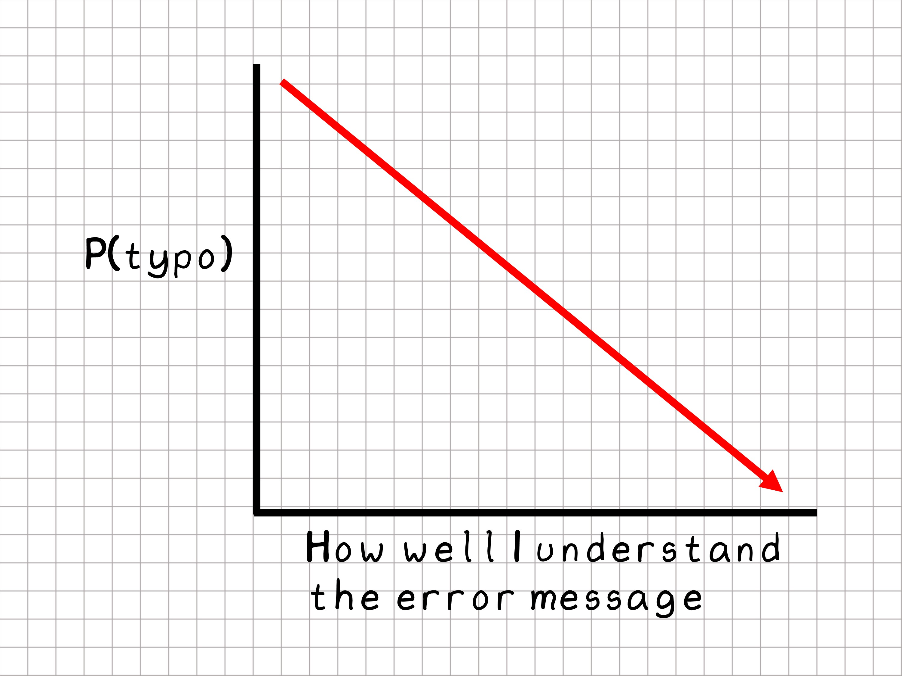

# Start Learning R {#getting_started}

```{r message=FALSE, warning=FALSE, paged.print=FALSE}
library(swirl)
library(tidyverse)
```

For this course I want you to read and understand everything in these chapters, including the R code. 

Especially the R code. 

When you see code leading to some output in this book, that means I think it is important for you to understand that code. I want you to read and try to understand it. 

The other stuff I've written in the chapters is about experimental design and statistics. Which are important, too. 

Writing R code is the method I've chosen for you to learn this statistical material. In general, R script forces us to be very explicit about what we are trying statistically. I think that is important for learning stats.

My code demonstrations are approached with parsimony. For example, my plots are pretty minimal. There is a LOT more that could be done with them. By being minimal, I'm leaving bandwidth for learning the statistical material. 

## Digging in with R/RStudio

After installation of R and RStudio, launching just RStudio on your machine should automagically start R.

Explore the RStudio menu bar and the RStudio panes. Click on stuff. Change stuff. There is very little for you to break! Most of the menu bar functionality is overkill for a beginner. But a few things are immediately useful.

Under `Tools` select `Global Options` and experiment with an font and color appearance configuration that pleases your eye.

Set the `Pane Layout` to your liking. I like source on top left, console on top right. YMMV.

Under `Session` you can select `Restart R`. Sometimes R needs a reboot. That will turn R off and on without having to close out RStudio and a document you might be working on within the document pane.

## The tidyverse package

The tidyverse is a collection of R packages designed for doing common tasks in data handling. We'll use tidyverse commands a lot. The tidyverse is a more modern syntax and I think more intuitive. Also, we'll be doing data visualization with `ggplot`, which is part of the tidyverse. See the next section for installation of the tidyverse packages.

### Do swirlstats

Once you have R and RStudio up and running a homework assignment will be to work on the R Programming module in the interactive [swirl package](https://swirlstats.com/). 

Install and load the swirl library by typing the following into the R console within R studio, line-by-line. Hit `enter` after each line so the code will run.

```
install.packages("tidyverse")
install.packages("swirl")
library(tidyverse)
library(swirl)

```

Swirl is basically a guided sandbox that will take you through an overview of the basics. 

There are a lot of basics, most of which you'll forget! But that's OK. I want you to see the 30,000 ft view. 

As you go through swirl I suggest you go to the source pane to open up a fresh R script file or R markdown file to take notes (eg, copy/paste swirl code snippets) for a custom cheat sheet. Experiment with running those snippets from a source code window and saving the source code file.

The first few weeks you'll probably come pack to your cheat sheet, until things get less foggy.

## Other resources

I've found these to be the most useful.

[R for Data Science](https://r4ds.had.co.nz/) is an outstanding resource for the scope of R in data analysis. Lot's of code tips.

The [STHDA website](http://www.sthda.com/english/wiki/ggplot2-essentials) has tips for coding most ggplots imaginable. You can scroll through, find the plot you want, and use their code to get started.

The [tidyverse website](https://www.tidyverse.org/) offers reproducible examples for using the functions of the core tidyverse packages.  

### Internet search

Just Google it. 

I usually only click on Stack Overflow links that come up in Google searches because SO focuses on reproducible code and solutions. The strong moderation helps keep things clean and organized.  

You'll probably never have to ask a question on SO. There's a good chance someone else asked it, and it has been answered already. 90% of the time the answers with the green checks will save you.

Note. We're going to focus on using the tidyverse functions. So when you Google for help, be sure to include that your looking for tidyverse-based solutions. 

For example, 

```
how to add a data frame column in r tidy

```
Adding `tidy` will show you solutions using tidyverse-based approaches.


### Help Documents

Another sources is `Help` within R. 

In the R console of RStudio you can type:

```
?ggplot

```
which will launch a help document for the `ggplot` function in the Help viewer pane.

It may take you some time to learn how to read R's Help documentation. Which tend to be cryptic. Functions have arguments and the help documents mostly just tell you about the scope of these arguments.

But the Help for all functions includes examples. **I think the easiest and fastest way to learn how to use a function is by playing with the examples.** Open a fresh R script document and paste example code into it. Run the example code line-by-line. Make some adjustments. See what happens.

### Package Vignettes

Many, but not all, packages have vignettes written by the package authors. These tend to offer deeper explanations than function Help documents.

### People

You can't learn without trying stuff. Don't be afraid to make errors. Lean on your classmates, lean on me, lean on the TA's. Engagement and interaction with a human is often the fastest way to get through a problem.

### typos

As you work with R you'll make mistakes. Of these, >90% will be typos. Misspellings, missing commas and unclosed parentheses or brackets will happen a lot. 

```{r echo=FALSE, fig.cap="The weirder the R error messages the more probably I have a typo.", fig.height=1.5, fig.width=2, message=FALSE, warning=FALSE, paged.print=FALSE}

```

The other 10% of mistakes come from assuming R can read your mind. 

Eventually you figure out R is very stupid (or obedient). That you need to tell R exactly what you want it to do, one instruction at a time. At that point, mistakes become less...frustrating.

A fast solution is often to copy and paste error messages into your browser search bar. Most of the errors you will make have happened before. Most of what you want to do someone has done before. 

But after a few searches if nothing is making sense, look for the typo.

Code camps are nice, but as a PhD student they will probably bore you pretty quickly because they tend to work on problems that don't interest you. By far the best way to learn R is to just start using it to solve the problems you need to solve. Whether they are problems in this course or with your own data.

I'll provide you the problems you need to solve in this course. They are mostly about learning statistics and reproducible data handling, and involve biomedical data sets. You'll end up learning how to use R as a side benefit.

