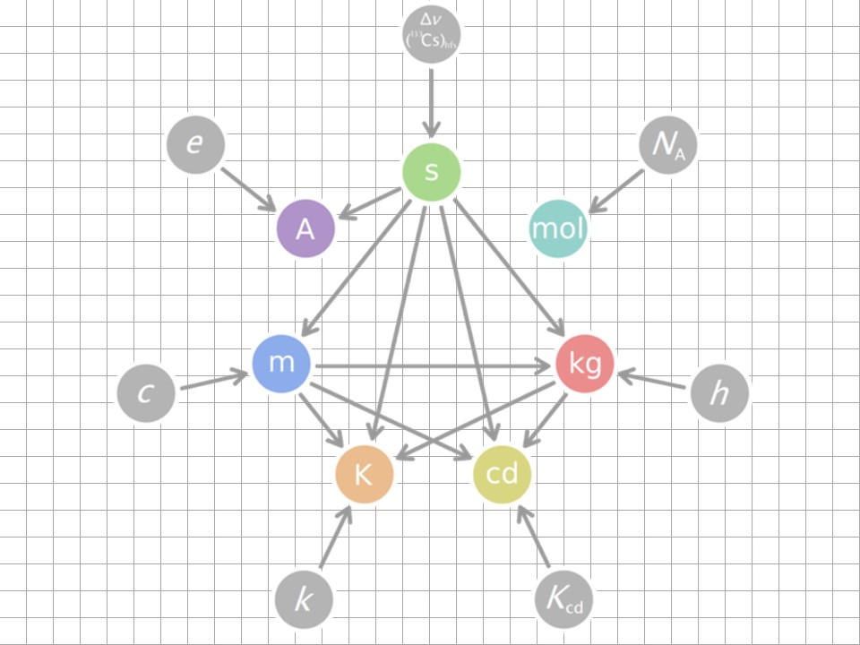

# Data Classification {#data}
```{r message=FALSE, warning=FALSE, paged.print=FALSE}
library(datapasta)
library(tidyverse)
library(viridis)
```

The starting point in any statistical design is to understand the types of data that are involved. 

First ask whether the variables are discrete or continuous. Then ask if they measured, ordered or sorted? Then ask which variables are controlled by the researcher and which arise as responses? The answers will point in the proper analytical direction. 

I cannot emphasize enough the importance of understanding data classification for mastering a statistical framework. It is the foundation. Therefore, this material covers perhaps the most important learning objectives in this course: 

Given an experimental data set, be able to

* Describe the variables that are dependent or independent.
* Describe each variable as either continuous (measured) or discrete (ordered or sorted).

A second focus of this chapter is on introducing some of the more common data handling procedures we'll do. The several scripts provide examples for how to import, inspect, subset, transform and visualize different types of data variables.

## Dependent and independent variables

The experimental researcher has two basic types of variables.

An independent variable is the predictor or explanatory variable controlled by the researcher. Independent variables are chosen, not collected. Nevertheless, they have values just like the values of collected data. 

For example, 

* In a blood glucose drug study, the independent variable "Treatment" would come in two levels, "Placebo" and "Drug". 
* In a study on how a gene influences behavior, the independent variable is "Genotype", with three values: "wild-type", "heteroozygous" and "knockout"
* In an enzyme activity assay, the independent variable is substrate, with a dozen or so values ranging over two orders of magnitude.

Conventionally, the independent variable is plotted on the abscissa, or x-axis, of some graph.

A dependent variable is the response or outcome variable collected in an experiment. The values that dependent variables can take on are determined by, or are dependent upon, the level of the independent variables. 

For example, 

* The variable "blood_glucose", collected from blood samples, has units of glucose concentration, with values over a large continuous range.

* In a Morris Water Maze test, memory is represented by a "time" variable, which is the time taken to find a remembered location, with unit values in seconds.

* Levels of product from an enzyme reaction are measured with an assay the emits fluorescence, in relative units. The dependent variable "RFU/mg" represents activity controlled by the amount of enzyme added and takes on many values over a continuous range.

Most of the time the dependent variable is plotted on the ordinate, or y-axis, of some graph.

### Statistical notation

Variables are abstracted in statistical modeling.

In the convention I'll use, the dependent variable is usually depicted by the uppercase symbol $Y$, to represent a variable name. 

Sometimes experiments (eg, anything with an -omics) generate multiple dependent variables, or $Y_j$. Here $j$ represents the number of dependent variables and can have values from 1 to $k$ different variables.  

The values one dependent variable can assume are symbolically represented as lowercase symbol $y_i$, where $i$ is the individual sample replicate, with values from 1 to $n$ independent replicates.

Univariate experiments will generate $y_i$ measurements from $1 X n$ replicates, whereas multivariate experiments will generate $y_{ij}$ measurements from $k x n$ replicates.

Similarly, the independent variable is usually depicted by uppercase $X$ (or some other letter) whereas the values are represented by lowercase $x_i$.

I'm going to use that convention but with a twist. Independent variables denoted using $X$ will represent continuous scaled variables, whereas independent variables denoted using $A$ or $B$, or $C$, will represent discrete, factorial variables. Factorial variables will take on values denoted by lowercase, eg, $a_i$, $b_i$, $c_i$).

Multivariable experiments have more than two independent variables. $X_j$ represents the name of the $j^{th}$ independent variable, where $j = 2\ to\ k$.

To illustrate dependent and independent variables think about a linear relationship between two continuous variables, $X$ and $Y$. This relationship can be expressed using the model $Y=\beta_0 + \beta_1 X$. 

$X$ is the variable the researcher manipulates, for example, time or the concentration of a substance. $Y$ would be a variable that the researcher measures, such as absorption or binding or fluorescence. Each has multiple values. 

The parameters $\beta_0$ and $\beta_1$ are constants that modify the relationship between the two variables, which I'm sure you recognize as representing the y-intercept and slope, respectively, of a straight regression line.

Thus, $Y$ takes on different values as the researcher manipulates the levels of $X$. Which explains why $Y$ depends on $X$.

For example, here's how the data for a protein standard curve experiment would be depicted. In the R script below the variable $X$ represents known concentrations of an immunoglobulin protein standard in $\mu g/ml$. The researcher builds this dilution series from a stock of known concentration, thus it is the independent variable.  

The variable $Y$ represents $A_{595}$, light absorption in a spectrophotometer for each of the values of the standard protein. The $A_{595}$ values depend upon the immunoglobulin concentration. Estimates for $\beta_0$ and $\beta_1$ are derived from running a linear regression on the data with the `lm(Y~X)` script. 

```{r}
#Protein assay data, X units ug/ml, Y units A595.

X <- c(0, 1.25, 2.5, 5, 10, 15, 20, 25)
Y <- c(0.000, 0.029, 0.060, 0.129, 0.250, 0.371, 0.491, 0.630)

#derive the slope and intercept by linear regression

lm(Y~X)
```

The output indicates the regression line intercepts the y-axis at a value very close to zero, and that every one unit increment in the value of $X$ predicts a 0.0249705 increment in the value of $Y$.

Fortunately, R functions rarely forces us to abstract by the mathematical statistics convention, X and Y. We can name variables in more comfortable terms. 

For example, 

```{r}
#Protein assay data, standard units ug/ml, absorbtion units A595.
standard <- c(0, 1.25, 2.5, 5, 10, 15, 20, 25)
A595 <- c(0.000, 0.029, 0.060, 0.129, 0.250, 0.371, 0.491, 0.630)

#derive the slope and intercept by linear regression
lm(A595 ~ standard)
```

### When there is no independent variable

The problem of drawing causal inference from studies in which all of the variables are observed, as is common in public health and other social sciences, is beyond the scope of this course. Pearl offers an excellent primer on considerations that must be applied to extract causality from observational data [here](http://ftp.cs.ucla.edu/pub/stat_ser/r350.pdf).     

## Discrete or continuous variables

No matter if they are dependent or independent variables, all variables can be subclassified further into two categories. They are either discrete or continuous.

Discrete variables can only take on discrete values, while continuous variables can take on values over a continuous range. This distinction is discussed further below.

Variables can be subclassified further as either **measured**, **ordered**, or **sorted**. This subdivision fulfills a few purposes. 

First, it's alliterative so hopefully easier to remember. It reminds me of Waffle House hash browns, which can be either scattered, smothered or covered.

Different authors/software give these three types of variables different names, which creates some confusion. SPSS users must click buttons to classify data as either scalar, ordinal, or nominal, which correspond to measured, ordered and sorted. Another fairly common descriptive for the three types is interval, integer, and categorical. Conceptually, they mean the same things.

```{r echo=FALSE}
measured <- c("scalar", "interval", "numeric", "continuous")
ordered <- c("ordinal", "integer", "factor/character/string/numeric", "discrete")
sorted <- c("nominal", "categorical", "factor/character/string", "discrete")

knitr::kable(tibble(measured, ordered, sorted), caption = "Common synonyms for types of variables")
```

Even if we can't agree on names, everybody seems to agree that all variables can be reduced to three fundamental subtypes.

Second, this taxonomy forms the basis for drawing a pragmatic statistical modeling heuristic to help you keep the relationship between variable type and experimental design (and analysis) straight. 

```{r fig.cap="The type of data dictates how the experiment should be modeled and analyzed.", message=FALSE, warning=FALSE, paged.print=FALSE, echo=FALSE}
knitr::include_graphics("images/testing_heuristic.jpg")
```

Third, the "measured, ordered, sorted" scheme classifies variables on the basis of their information density, where measured > ordered > sorted. You'll see below how discrete variables lack the kind of information density of continuous variables. 

**More pragmatically, measured, ordered and sorted variables behave differently because they represent different kinds of information. They tend to have very different probability distributions. As a result statisticians have devised statistical models that are more appropriate for one or the other.**

### Measured variables

Measured variables are fairly easy to spot. Any derivative of one of the [seven base SI units](https://www.nist.gov/pml/weights-and-measures/metric-si/si-units) will be a measured variable. 

The gang of seven are the ampere, second, mole, kilogram, candela, Kelvin, and meter.  When in doubt, a working hack is that these variables tend to need instruments to take measurements. So if you're using some instrument to measure something, and it is not counting events, it is a measured variable.

```{r, fig.cap = "The seven SI units", echo=FALSE}

```

Take mass as an example. The masses of physical objects can be measured on a continuous scale of sizes ranging from super-galaxian to subatomic. Variables that are in units of mass take on a smooth continuum of values over this entire range because mass scales are infinitesimally divisible. 

Here's a thought experiment for what that means. Take an object that weighs a kilogram, cut it in half and measure what's left. You have two objects that are each one half a kilogram. Now repeat that process again and again. 

After each split something with mass always remains. Even when you arrive at the point where only a single proton remains it can be smashed into even smaller pieces in a supercollider, yielding trails of subatomic particles....most of which have observable masses.  

**But here's what's most different about continuous variables: That continuity between gradations means that continuous variables carry more information than other types of variables.**

On a scale of micrograms, objects weighing one kilogram would have one billion subdivisions. If you have an instrument that can weigh the mass of kilogram-sized objects at microgram precision, you would say that one kilogram is comprised of a billion bits of information.

That's more information than sorting an object by naming it "heavy" or "light".

#### Visualizing measured variables

In the precourse survey biostats students self-reported their height, in cm, which is a continuous scale. Height is a measured variable. 

Viewed in scatter plots, it is easy to see how the height variable takes on many different values on the y-scale. (The points have been colored by sex, mostly to illustrate how cool it is to segment one variable (height) using another (sex)). 

```{r fig.cap="Scatterplot of biostat student heights segmented by sex", fig.width=5, message=FALSE, warning=FALSE, fig.height=4}
pcd <- read_csv("datasets/precourse.csv")

# omit heights <125 cm and >250 cm as unreliable entries
# nobody that short or tall has ever taken the course!

ggplot(data = pcd %>% 
         filter(height > 125 & height < 250)) +
  geom_jitter(aes(x=factor(0), y = height, color = sex), 
              height = 0, width = 0.4, size = 4, alpha = 0.8) +
  scale_color_viridis_d(begin= 0.1, end = 0.6)+
  scale_y_continuous(breaks = seq(140, 200, 10)) +
  xlab("biostats students") +
  ylab("height(cm)") +
  theme(axis.ticks.x = element_blank(), 
        axis.text.x = element_blank()
        )
```

It's always important to do a quick histogram of measured data. Histograms categorize height values into bins of a given number or width. The `geom_histogram` then counts the number of values in each bin. Histograms therefore show the frequency distribution of a variable.

```{r message=FALSE, warning=FALSE, fig.width=5, fig.cap = "Histogram of biostat student heights, the most frequent height value is 170 +/- 1.25 cm."}
ggplot(data=pcd %>% filter(height > 125 & height < 250)) +
  geom_histogram(aes(x=height), binwidth = 2.5, color = "#f2a900", fill = "#012169")
```

### Discrete categorical and ordinal variables

Discrete variables are discontinuous. The units of discrete variables are indivisible. Unlike continuous variables, discrete variables have no information between their unit values.

There are two types of discrete variables, either **ordered** or **sorted**. 

#### Sorted data

These variables represent objects somehow scored as belonging to one nominal category of attributes or some other. In other words, the objects are sorted into categories. You can also think of this as being sorted into buckets or bins based upon some common feature(s). The scoring process can be based upon either objective or subjective criteria.

*Statisticians generally frown at researchers who sort replicates on the basis of perfectly good measured data. For example, sorting people into low, mid and high blood pressure on the basis of a cuff blood pressure measurement. These instruments generate continuous variables on inherently more informative scales. Statisticians hold that sorting after measurement discards valuable information. And cut offs can be arbitrary.*

In a survey biostats students identify their sex as either male or female. The name of the variable is `sex`. The values that `sex`can have are either `male` or `female`. The variable has only two nominal levels (or two categories): male and female. 

Perhaps most important, sorted variables have no intrinsic numeric value. Male is neither higher nor lesser than female; the values of the sex variable are just different. *Wanting* more of one or the other shouldn't be conflated with a variables inherent properties.  

Sorted variables are also called `factors`. That's the dominant jargon in R. We'll find ourselves converting variables to factors at times.

**In stats jargon, sorted, nominal, categorical, and factor are words used to represent the same kind of variable. Sorry**

Try not to let the jargon confuse you. What's most important to understand is that sorted variables lack numeric values. So we count how many are sorted into one category or the other. That changes everything about the statistical methods we apply to experiments involving sorted variables.

A count is an integer value. The count cannot take on any values other than integer values. For example, we don't have cases where there is a partial student of one sex or the other. These counts exist as discrete, discontinuous values. 

Of course, the categorization of sex is sometimes ambiguous. When important to accommodate more than two categories, we would add additional categories to account for all possible outcomes. For example, the `sex` variable could be set to take on values of `male`, `female`, and `other`.

#### Visualizing sorted data

Let's look at the precourse survey data frame we imported above. Each row represents the data for one biostats student. Notice how the values for the sex variable are characters. There are no numbers to plot!!  

I could assign them numbers if I wished, for example $Male = 0$ and $Female = 1$, but that is just arbitrary numeric coding, using numbers rather than characters. The numeric values are meaningless. I could just as easily code one $1.2345$ and the other $0.009876$ and accomplish the same thing. The point being the values of sorted variables are arbitrary.

```{r}

head(pcd)

```

We'll plot the sex variable data using a function, `geom_bar`. This geom not only makes bars, it also sums up the number of `Male` and `Female` instances in the variable sex. Note there are no error bars. Counts are just a sum, there is no variation.

In this course, we'll avoid bar plots for everything other than visualizing variables that summarize as counts. We could have also used pie charts or stacked bars, but those are harder to read. The chosen method is a better way to illustrate the magnitude of the counts and the difference between the two levels within the sex variable.

Note how this bar plot is, effectively, a histogram of the sex variable. Here the bins are defined by the two values of the variable.

```{r, fig.width=5, fig.cap = "Use bar plots to display the relative counts of sorted variable values."}
ggplot(pcd)+
  geom_bar(aes(x=sex), width = 0.5)
```

Many biomedical experiments generate discrete sorted data, too. 

Imagine the following:

* Neurons are poked with an electrode. Counts are recorded of the number of times they depolarize over a certain time period. Counts are compared between various treatments, such activating an upstream neuron at different levels.  
* Cells are stained for expression of a marker protein. The number of cells in which the protein is detected are counted. Counts are compared between various treatments, such as a knockdown and its control.
* By some criteria, cells are judged to be either alive or dead and counted as such. The number of alive cells are counted after manipulating expression of a tumor suppressor gene, and compared to a control.
* By some criteria, mice are judged to either show a disease phenotype or not, and counted as such. Disease incidence is counted in response to levels of a therapeutic agent, or a background genotype, or in response to some stressor.

There are an infinite number of examples for experiments that can be performed in which a dependent variable is sorted. For each replicate the researcher decides what nominal category it should be sorted into. 

Sometimes sorting occurs after some fairly sophisticated biological manipulation, instrumentation or biochemical analysis, where in the end all the researcher has are a count of the number of times one thing happened or some other.

#### Ordered data

Ordered data is, in one sense, a hybrid cross of sorted and measured data. Ordinal is another common jargon term used to describe such variables.

If you've ever taken a poll in which you've been asked to evaluate something on a scale ranging from something akin to "below low" to "super very high"...then you've experienced ordinal scaling (such scales are called Likert scales). 

The ordered variable's values are, in one sense, categorical: "low", "med", and "high" differ qualitatively. Each lacks a precise quantitative value. In that sense, they are like sorted variables. 

However, there is a quantitative, if inexact, relationship *between* the values. "High" implies more than "med" which implies more than "low". An underlying gradation exists in the variable's scale. This is not just the absence or presence of an attribute. Rather, the scale allows for some amount of the attribute relative to other possible amounts of the attribute.

Ordinal variables are discrete, because no values exist between the categories on the scale.

The precourse survey is chock full of questions that generate data on an ordered scale. For example, one asks students about their `enthusiasm` for taking the course. They can select answers ranging from 1 ("Truly none") to 10 ("Absolutely giddy with excitement").

Even though numbers are used as categories, their values are arbitrary, not quantitative, except to imply a 2 means more enthusiasm than a 1, and so on. The variable values could just as easily be: "Truly none", "Very little", "Slightly more than very little", ... and so on.

In a survey, the participant selects the level for the variable. When we do an experiment, replicates are evaluated and then categorized to one of the values of the ordinal scale.

Disability status scales are classic ordinal scales. These are used to assess neurological abnormalities, for example, those associated with experimental multiple sclerosis. Each replicate in a study is evaluated by trained researchers and assigned the most appropriate value given its condition: 0 for no disease, 1 for limp tail, 2 for mild paraparesis, 3 for moderate paraparesis, 4 for complete hind limb paralysis, and 5 for moribund. 

Obviously, in this ordinal scale, as the numeric value increases so to does the severity of the subject's condition. 

Here's what a very small set of ordinal data might look like. Imagine doing a small pilot study to determine whether ND4 gene deletion causes neurological impairment. Here's how the data from a lab notebook would be transcribed into an R script to make a summary table:

```{r}
genotype <- c(rep("wt", 3), rep("ND4", 3))
DSS_score <- as.integer(c(0,1,1,5,3,5))

results <- tibble(genotype, DSS_score); results
```

Let's make sure we understand the variables.

The independent variable is `genotype`, a factorial variable that comes in two nominal levels, `wt` or `ND4`. `DSS_score` is a dependent variable that comes in 6 levels (integer values ranging from 0 to 5). I'm forcing R to read `DSS_score` for what it is, an integer rather than as a numeric.

However, the values 0 to 5 are nominally arbitrary. This only differs from a sorted varialble because a value of 1 means more than zero, 2 means more than 1, and so on.

#### Visualizing ordered variables

Let's visualize the enthusiasm biostats students have for taking a course.

Here's a bar plot. Here again, `geom_bar` not only draws bars, it also counts the total number of biostat students who voted for each of the 10 levels. A bar plot of counted data is just a poor man's histogram.

```{r}
ggplot(pcd) +
  geom_bar(aes(x=enthusiasm))+
  scale_x_continuous(breaks=seq(1, 10, 1))
           
```

Viewed using the histogram function, we see the same thing, if we dial the binwidth to the unit of the ordinal scale or the number of bins to the length of the ordinal scale.

It is easy to see the data are skewed a bit to the right of the scale center. I mention this because ordered data are frequently skewed. Variables of counts should not be expected to obey a symmetrical normal distribution.

Although it is tempting to compute descriptives like means and standard deviations and even run t-tests and ANOVA on such data, slow down and have a thought about that. The values are arbitrary.

If instead of 1, 2, 3,... the variable values were "Truly none", "Very little", "Slightly more than very little", ..., how exactly would you compute a mean and standard deviation?

You could not.

A cognitive bias is equating numeric discrete yet arbitrary scale with a continuous, equal interval scale. 

```{r, fig.width=5, fig.cap = "An ordered variable plotted as histogram."}
ggplot(pcd) +
  geom_histogram(aes(x=enthusiasm), 
                 binwidth = 1, color = "#f2a900", fill = "#012169") +
  scale_x_continuous(breaks=seq(1, 10, 1))
```

Viewing scatter plots of discrete data really brings forth their discretiness. They show how there is obviously no information between levels of the ordered scale used in this survey instrument. 

```{r, fig.width=5, fig.caption="Scatterplots dramatize the discrete nature of ordered variables."}

# the height argument in geom_jitter is crucial to seeing this pattern
# adjust the height value to see what happens

ggplot(pcd) +
  geom_jitter(aes(x=factor(1), y=enthusiasm), 
              height=0, width = 0.4, size = 4, alpha = 0.6) +
  scale_y_discrete(limits = c(1:10)) +
  xlab("biostats students") +
  theme(axis.ticks.x = element_blank(), 
        axis.text.x = element_blank()
        ) 
  
```

Although you can calculate an mean for a variable such as this, whether you should report it to one significant digit or beyond is fraught with portent.

### Rescaling variables

Treating an ordered scale as if it were continuous is called rescaling.

Commonly researchers transform discrete variables onto a continous scale, and vice versa. Rescaling requires some judgment. 

The most frequent transformation is of raw count data to percents. This usually has descriptive value but can introduce problems when used inferentially. 

For example, the two percent values for the sex variable below are useless for asking whether there is a statistical difference from, say, 50%. The transformation converted 386 bits of information into 2. 

By keeping it in counts we can test the null hypothesis that the proportion of 144/242 does not differ from 50/50, by performing a proportion test.

```{r}
pcd %>% 
  count(sex) %>% 
  mutate(total=sum(n), percent=100*n/total)

```

Another common transformation is treating ordinal independent variables as if they are, in fact, continuous. 

In addition to the fact that these scales are arbitrary, there are a couple of other problems that should be thought through before transforming. First, an ordinal variable like `enthusiasm` is bounded. Values below 1 and above 10 are not possible. Continuous sampling distributions, such as the t-distribution, are premised upon variables that have no bound.

Another major question that arises with ordinal scales is whether it is safe to assume the intervals between the units are equal. Is the difference between a 1 and a 2 score on the `enthusiasm` variable the same as the difference between a 9 and a 10 score? Descriptive parameters of continuous scales, such as mean and standard deviation, can apply when these interval magnitudes equal. And tests based upon the t sampling distribution operate on an assumption of equal interval scaling.

When all of these issues cannot be assumed, the nonparametric tests provide perfectly good inferential tools for ordinal data.

## Working with data

Some of the code chunks above show scripts for manipulating and viewing data. The section below is a more formal but quick primer on R data entry, inspection, summation and visualization with ggplot. The focus here is conceptual with simple quick examples to help you get started.

### Entering data

There are three main ways:

* Type from your lab notes by keyboard into an R source.
* Copy to clipboard from some file, paste using the `datapasta` package.
* Read from a file.

#### Typing in variables and making a data frame

Let's say we have some data in a lab notebook. These are results from a small pilot experiment comparing the effect on neurological function of knockout of the ND4 gene to wild-type. Lab meeting is in 10 minutes.

The knockout and wild-type are two values of the variable genotype, which is sorted.

Neurological function is assessed using the 6-value [disability status scale](https://www.sralab.org/rehabilitation-measures/expanded-disability-status-scale-kurtzke-functional-systems-score), which is an ordered variable.

Both variables are discrete.

Saving the Rscript (or Rmarkdown) file stores the data. 

The function `tibble()` creates a tidyverse data frame.

```{r fig.width=5,}
# understand the logic of creating vector objects for the
# independent and the dependent variables
# note how a tibble-type data frame is created

# vector objects represent the variables
genotype <- c(rep("wt", 3), rep("ND4", 3))
DSS_score <- as.integer(c(0,1,1,5,3,5))

# put the variables in a data frame object
results <- tibble(genotype, DSS_score); results

ggplot(results, aes(x=genotype, y=DSS_score)) +
  geom_jitter(height=0, width=0.3, size=4)

```

#### Using datapasta

This is a good way to import large chunks of data from other formats.

1. View a data file on your machine, such as an excel sheet.

2. Copy the data you want to your machine's clipboard. 

3. In an Rscript or chunk, name an empty object (eg, `song <-c()`). 

4. Place the cursor inside the parentheses.

5. Click on the Addins icon below the RStudio menu bar and select an option. 

Here I copied the `fav_song` column (including header) from the `precourse.csv` file. Probably due to that header, datapasta coerced the values as characters. Some munging will be necessary to clean things and turn everything into numeric values. But at least it's in R now. Woot.

```{r}
song <-c("fav_song", NA, NA, NA, NA, NA, NA, NA, NA, NA, NA, NA, NA, NA, NA, NA, NA, NA, NA, NA, NA, NA, NA, NA, NA, NA, NA, NA, NA, NA, NA, NA, NA, NA, NA, NA, NA, NA, NA, NA, NA, NA, NA, NA, NA, NA, NA, NA, NA, NA, NA, NA, NA, "570", "576", "232", "204", "524", "252", "588", "201", "212", "221", NA, "265", "294", "217", "246", "481", "480", "200", "180", "210", "203", "210", "172", "255", "375", "698", "234", "242", "256", "288", "272", "273", "601", "293", "260", "120", "300", "147", "272", "202.2", "274", "293", "262", "555", "362", "260", "180", "237", "300", "373", "121", "361", "179", "169", "201", "194", "246", "139", "210", "234", "292", "217", "412", "172", "289", "214", "180", "448", "180", "207", "74", "253", "256", "243", "187", "420", "200", "235", "185", "246", "172", "258", "213", "188", "258", "201", "214", "210", "230", "5421", "259", "222", "171", "184", "220", "225", "295", "240", "250", "204", "208", "254", "341", "233", "232", "455", "423", "246", "570", "319", "0", "205", "240", "260", "126", "480", "210", "226.93", "0", "300", "180", "298", "290", "202", "194", "246", "232", "210", "150", "236", "174", "260", "300", "565", "273", "245", "360", "174", "276", "293", "460", "240", "583", "90", "180", "240", "244", "127", "210", "211", "240", "220", "241", "180", "230", "180", "198", "133", "272", "293", "296", "230", "212", "195.6", "187", "200", "234", "200", "240", "295", "183", "216", "286", "192", "270", "360", "262", "268", "234", "1560", "197", "261", "279", "195", "251", "295", "461", "360", "218", "185", "250", "257", "210", "199", "210", "210", "200", "261", "237", "226", "331", "261", "190", "222", "180", "284", "120", "255", "222", "3", "200", "235", "277", "314", "249", "75", "300", "277", "250", "241", "209", "250", "200", "210", "402", "360", "205", "345", "252", "305", "201", "170", "213", "656", "240", "339", "172", "263", "239", "135", "210", "230", "185", "292", "210", "432", "200", "192", "21", "215", "240", "240", "200", "480", "247", "200", "253", "230", "355", "214", "332", "2450", "300", "180", "237", "379", "516", "180", "184", "218", "222", "194", "160", "234", "238", "208", "250", "123", "240", "226", "237", "176", "200", "192", "347", "255", "254", "255", "240", "480", "240", "456", "223", "236", "201", "190", "226", "300", "288", "681", "180", "352", "270", "245", "180", "229", "180", "221", "320", "217", "236", "352", "233", "214.8", "262", "179", "221", "227", "241", "180", "2640", "364", "240", "382", "243", "204", "185", "240", "298", "155", "216", "24840", "180", "202")

```

#### Reading a file

Of the three data entry methods, reading a file is the *most reproducible*. 

Raw data are read from files into R objects using a script. The data object represents all the values from the file and is now in the environment. The object can be worked on to fix, segment, summarize, and visualize the data. 

After the initial read step, the raw data file remains untouched. Which is very good. As a general rule, just save the script and never write over raw data because doing so changes the raw data.

When you need to work on the data later in a new R session, just re-run the saved script, including the read step.

This is a very different way of working with data compared to using GUI-based software. We don't create and save all sorts of new sheets of edited or interpreted data. Or overwrite the original data sheet.

We just write a script, and change it until we get exactly what we want. The script provides the reproducible record of how the data was manipulated. 

We'll (mostly) use `.csv` files as a data source in this course. The same basic reading approach used for that is applicable to all kinds of other data sources. Many different R functions exist to read from many different types of data sources. 

Here's how to import the precourse survey data using the `read_csv` function from the tidyverse `readr` package.

```{r}
# my working directory has a subdirectory named datasets

# the precourse.csv file is in the datasets folder

# If the csv file is in your working directory, just do: pcd <- read_csv("precourse.csv)

pcd <- read_csv("datasets/precourse.csv")

```

Inspect the data to make sure it is what you think it is.

```{r}
# get in the havit of inspecting data, several ways 

str(pcd)
head(pcd)
view(pcd)

```

There are a handful of functions in R land for reading `.csv` data. They don't all work the same,

#### Subsetting, transforming and summarizing data

Before diving into data munging learn some more about R syntax/logic:

1. Functions have one or more arguments, placed inside (). Commas always separate arguments, and one argument is usually some sort of data object or a function that has a data argument.
 
```{r eval = FALSE,  message=FALSE, warning=FALSE}

# prototype function
foo(arg1, arg2, arg3, ...)

# for example:

x <- c(1, 2, 3, 4 ,5, NA)

# x is an argument
# na.rm = T is also an argument

# two arguments needed because x has NA, and mean won't ignore NA unless told

mean(x, na.rm = T)

```

2. Functions can work sequentially inside other functions.

The pipe function, `%>%`, from the `dplyr` package will be your best friend in the course if you allow it. In English, `%>%` means 'then' or 'next'.  

For example:

```{r eval = FALSE, message=FALSE, warning=FALSE}

# old fashioned R syntax, hard to read and write, NTTAWWT:

work(commute(shower(breakfast(walk_dog(bathroom(wake_up(me)))))))

# piping is more natural

workday <- me %>% 
  wake_up() %>% 
  bathroom() %>% 
  walk_dog() %>% 
  breakfast() %>% 
  shower() %>%  
  commute() %>% 
  work()

# I saw this analogy on twitter and wish I'd invented it

```

Your process should be making sure each step works before going to the next. And if you're not getting what you want, maybe your steps are not in the right order?

3. Five MUST KNOW functions 

(there will be a few more later, including `ggplot` and `pivot_longer`, nee `gather`)

Here is a goal: Generate some descriptive statistics, for only valid heights of male and female biostats students, in units of inches rather than centimeters. 

Here is a solution.

```{r}
pcd %>% 
  select(height, sex) %>% 
  filter(height > 125 & height < 250) %>% 
  mutate(height = height/2.54) %>% 
  group_by(sex) %>% 
  summarise(mean = mean(height),
            sd = sd(height),
            n = length(height))

```

Think about these functions:

* `select` chooses variables (columns) from a data frame
* `filter` chooses rows
* `mutate` is how you transform variables, clever, huh?
* `group_by` segmentation, based upon values of the argued variable
* `summarise` calculates any summary statistic you can imagine

4. There are many ways to do the same thing, or pretty much the same thing

```{r}

# need a data frame object of random normal values?

a <- rnorm(5)
b <- rnorm(5)

oneway <- data.frame(a, b)
another <- data.frame(a = rnorm(5), b = rnorm(5))
prettyMuchSame <- tibble(a, b)

```


#### Evolution of a visualization

We use ggplot in this course. The ability to make plots is essential in statistical design and analysis of experiments.

The 10 step procedure below is mostly conceptual, but has code you can learn a lot from right out of the gate.

Also, although this is about building a ggplot, conceptionally, the same step-by-step process is used to do any other coding task.

Let's begin....

Creating a presentation quality ggplot is no different than a [Bob Ross oil painting](https://www.youtube.com/watch?v=B5Wo1ubuzAE). 

It is a process.

We begin with an idea of what we want to create.

Then we make a blank canvas, to which stuff is added, one step at a time. 

Improve it through iteration, tweaking, slowly but surely, argument by argument, line by line.

There you go. Anybody can ggplot.

Let's make a cool image of biostat student heights.

1. The default ggplot creates the blank canvas

```{r fig.height=1.5, fig.width=1.5, fig.cap="Not much, but it is a start."}
ggplot()
```

2. The data must be in a data frame. It's there now, but still a blank canvas.

```{r fig.height=1.5, fig.width=1.5, fig.cap="The nothingness belies real progress"}
ggplot(data = pcd)
```

3. Assign variables to the canvas coordinates using the aesthetics function. No longer blank.

```{r fig.height=1.5, fig.width=1.5, fig.cap = "Woot! Something happened."}
ggplot(data = pcd, aes(x=sex, y=height))
```

4. Geom's bring the data into view. Aesthetics can also be argued in geom functions.

```{r fig.height=1.5, fig.width=1.5, fig.cap="Woot! Data!"}
ggplot(data = pcd) +
  geom_point(aes(x=sex, y=height))
```

5. Ugh, outliers, no grad student is ever that tall or short. Munge the data inside the ggplot function. On the fly!

```{r fig.height=1.5, fig.width=1.5, fig.cap="Fix the problem right in the data frame."}
ggplot(data = pcd %>% 
         filter(height > 125 & height < 250), 
       ) +
  geom_point(aes(x=sex, y=height))
```

6. Not a good use case for `geom_point`. 

```{r fig.height=1.5, fig.width=1.5, fig.cap="Try a different geom."}
ggplot(data = pcd %>% 
         filter(height > 125 & height < 250), 
       aes(x=sex, y=height)) +
  geom_jitter()
```

7. Customize the geom.

```{r fig.height=1.5, fig.width=1.5, fig.cap="Let's call this Bob-Rossing the plot."}
ggplot(data = pcd %>% 
         filter(height > 125 & height < 250), 
       aes(x=sex, y=height)) +
  geom_jitter(shape = 22, height = 0, 
              width = 0.2, color = "blue",
              size = 4, alpha = 0.6)
```

8. Customize the axis

```{r fig.cap="More Bob-Rossing."}
ggplot(data = pcd %>% 
         filter(height > 125 & height < 250), 
       aes(x=sex, y=height)) +
  geom_jitter(shape = 22, height = 0, 
              width = 0.2, color = "blue",
              size = 4, alpha = 0.6)+
  labs(title= "Precourse Survey",
       subtitle= "2014-2020",
       caption="IBS538 Spring 2020",
       tag = "Biostats",
       x="sex chromosome",
       y="verticality, cm")+
  scale_x_discrete(labels= c("XX", "XY"))


```

9. Customize the frame & theme

```{r fig.cap="And more Bob-Rossing."}
ggplot(data = pcd %>% 
         filter(height > 125 & height < 250), 
       aes(x=sex, y=height)) +
  geom_jitter(shape = 22, height = 0, 
              width = 0.2, color = "blue",
              size = 4, alpha = 0.6)+
  labs(title= "Precourse Survey",
       subtitle= "2014-2020",
       caption="IBS538 Spring 2020",
       tag = "Biostats",
       x="sex chromosome",
       y="verticality, cm")+
  scale_x_discrete(labels= c("XX", "XY"))+
  theme_classic()

```

10. Last minute changes. The audience won't "get" cm. Transform variable to inches. Oh, and segment using a third variable and applying scaling colors.

```{r fig.cap="Finish with a dramatic combination data munge, Bob-Rossing flourish."}
ggplot(data = pcd %>% 
         filter(height > 125 & height < 250) %>% 
         mutate(height = height/2.54),
       aes(x=sex, y=height, color = term)) +
  geom_jitter(shape = 18, height = 0, 
              width = 0.2,
              size = 3, alpha = 1)+
  labs(title= "Precourse Survey",
       subtitle= "2014-2020",
       caption="IBS538 Spring 2020",
       tag = "Biostats",
       x="sex chromosome",
       y="verticality, INCHES")+
  scale_x_discrete(labels= c("XX", "XY"))+
  theme_classic()+
  scale_color_viridis(begin = 0.1, end =0.9)
```

**Much more could still be done, but I promised myself to stop at 10 steps. Start small, grow it. Play with it until you like it.**

If that seems like a lot to code just for one figure, note that it is reproducible and modular. These latter features can be exploited with only slightly higher level R skills to repeatedly reuse the same custom format on many different data sets and variables.

## Summary

We're going to talk about data a lot more the rest of the semester. So far we've covered these fundamentals.

* An experimental researchers collects measures for dependent variables after imposing independent variables on a system.
* Both dependent and independent variables can be either discrete or continuous. 
* Discrete variables can be either ordered or sorted. 
* Continuous variables are measured.
* Statistical treatment depends upon the type of variables involved in the experiment.
* Use R to inspect, modify and visualize variables.
* All R coding is like building a ggplot, through an iterative, step-by-step process.
* It pays to understand the starting material you have (date) to get the end product you want (analysis).

