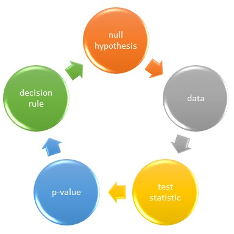

# Framing statistical hypotheses {#hypotheses}

*“There is no more to science than its method, and there is no more to its method than Popper has said.”-Hermann Bondi*

Hypothesis-driven research tests predictions about the nature of the world. 

Testing hypotheses statistically provides a pragmatic framework for making decisions about the validity of those predictions.

When planning an experiment the primary goal should be to bring hyper-focused clarity to the hypothesis. This is the time to distill your thinking down to the exact question you want answered. What are you studying? What is not known? What is your prediction? How will you measure it? What are your variables? Are they discrete or continuous? How will you test it? How will you decide whether what you predicted happened or not? Will this actually answer the question you're asking?

The statistics taught in this course are for assessing the validity of experimental outcomes. The validity of the statistical test depends upon the integrity of the experimental conditions. What are the researchers intentions? Is a specific hypothesis in mind? Have test groups and replicates been planned in advance? What levels of error does the researcher tolerate? What are the independent replicates? Are they randomly selected? What types of variables are involved?

The statistical tests taught in this course are valid for experiments that are planned in advance, run according to that plan, and which test a specific hypothesis.

Somewhat oddly, we test the null hypothesis.

The expectation is to generate observations of such extreme magnitude that we can reject the null, the hypothesis that nothing happened. At first blush that might come off as absurd. Like a Seinfeld episode, where nothing is what is most important.

Hopefully this won't seem so odd after I explain why it is done this way.

## The decision process

Everybody knows something about the p-value. When it's low enough, the experiment "worked". Before diving into the nitty gritty of p-values, let's jump into a wider angle format to flesh out how they are used. 

The framework can be broken down into 5 key steps:

i. We begin with a null hypothesis--yes, the boring one about nothing.
ii. Experiments generate data.
iii. The data are transformed into test statistics, which are essentially just signal-to-noise ratios. 
iv. P-values are calculated from the experiment's test statistic value. 
v. Based upon *a priori* thresholds, a decision is made to reject a null hypothesis, or not, depending upon the extremeness of the result.

```{r, echo=FALSE, fig.width=5, fig.align="center", fig.cap = "Statistical hypotheses test the null in a multistep process"}

```

Low p-values are associated with extreme values of a test statistic. The researcher gets to define what they feel is extreme.

Extreme values of test statistics can happen either when the effect sizes are high or when the sample size is large. Rejecting a null on the basis of a p-value means our test statistic value is too extreme to belong in the distribution of null test statistic values. 

Thus, a low p-value means the test statistic is improbably high if the treatment, in fact, is not truly effective.

**If you learn nothing more in this course, learn that the statistics discussed here are tests of the null hypothesis.** 

## Popper and falsification

Using data to falsify an hypothesis, even if that hypothesis is the null, is a decision framework that plays well with philosopher Karl Popper's assertion that [scientific theories are probative](https://plato.stanford.edu/entries/popper/#ProbDema) and that unscientific theories are not. 

To Popper, the grandest scientific theories are those that can be falsified. In Popperian logic, the truth of nature is unknowable and unproveable....even though it is testable. Thus, the scientific method advocated by Popper doesn't allow for proving an hypothesis, but at the same time it doesn't forbid us from rejecting hypotheses that are inconsistent with observations. 

Enter the null hypothesis, which predicts, of course, that nothing happens. The null is a handy device because if we make observations that are inconsistent with the null, we reject it. Thus, positive experimental results falsify the null.

Imagine an experiment to test whether a drug lowers blood glucose in people who have diabetes. When the glucose-lowering effect size for the drug in the sample is large enough, we can reject the hypothesis that the drug didn't have any effect.

In other words, we will accept an observation as evidence for a positive result by formally concluding that same evidence is inconsistent with a negative result.

Some argue that this logic forces the researcher to test the "wrong" hypothesis and to also accept an alternate hypothesis that itself may not be true. For example, although blood glucose may be lower in the drug treatment arm of the sample, that lowering may have occurred by random chance.

Or an unknown confounder variable that wasn't controlled for could be responsible for the observation that drug-treatment is associated with lower blood glucose. 

__In these cases we would make an error by rejecting the null when it is actually true. Which is a type1 error.__

The p-value gives us some idea about how likely we are to make that error. When the p-value is very low, and when the experiment is well-conducted, we can have some confidence we are not making that mistake.

Of course, rejecting the null is provisional. All gained knowledge is provisional. Drawing a conclusion from one experiment doesn't preclude testing the experiment some other way. If the problem is important enough (and "real"), it will be tested from a few complementary approaches. A good idea will need to survive the preponderance of the evidence.

I'm personally convinced the alternative approach, which is to seek out evidence that affirms an hypothesis, is not better. This lies at the heart of what Popper stood against. There is an inherent confirmation bias in seeking out affirmation of ideas. In the proper light, any evidence can be made to look attractive. 
Furthermore, what if, in seeking affirmation, nothing happens? Negative results are very difficult to interpret because the absence of evidence cannot be interpreted as the evidence of absence.

So I'd hope the researcher who gives all this some thought will find null falsification if not ingenious at least pragmatic. It allows us to move forward on the basis of positive evidence (granted, which may be wrong and we don't know it), while at the same time practicing a more sound, more unbiased scientific methodology (hypothesis falsification rather than affirmation). 

## Operational decisions made in advance that reduce mistakes

Meanwhile, this statistical framework does allow for the possibility of designing experimental conditions to minimize false positive (type1) and false negative (type2) errors. We can operationalize our tolerance for those kinds of mistakes in meaningful ways such that we are less likely to become victims of bad luck.

Specifically, we put advanced effort into planning the experiment. In particular, planning for a sample size means that we have had to make a decision about type1 & type2 error tolerance, while explicitly predicting an effect size that would be believable.

The decision to reject a null hypothesis can stand alone. It need not be the same as a decision to accept the alternate. Rejecting the null only asserts that the experimental evidence is inconsistent with the null. In no way does that "prove"" the alternative hypothesis.

For most, some of these concerns should become even less of a problem when the null and alternate hypotheses are explicitly framed in terms of population parameters and their **mutually exclusive and collectively exhaustive** outcomes. This approach doesn't leave much room for ambiguity about what is being declared at the decision step. 

For example, the null hypothesis for the diabetes case is very explicit: $null, H_0: \mu_{placebo} = \mu_{drug}$, Here $\mu$, since it is greek notation, represents the mean blood glucose in concentration units in the population from which the sample was drawn.

Now that we have a bona fide null hypothesis, we can state the alternate hypothesis as everything the null can't be: $alternate, H_1: \mu_{placebo}\ \ne \mu_{drug}$

In other words, the inference operates on the basis of straightforward mathematical principles. Two parameters that are compared either meet our prescribed expectations, or they do not. In this case, if we reject the hypothesis that the means of the two groups are equal, then they can only be not equal.

Are they truly not equal? We can never know for sure, but we are operating within a framework of known error tolerances.

## Statistical hypothesis rubric

Researchers have to grapple with two types of hypotheses. One type is the grand, paradigm-driving assertion of some key insight, which is designed to express the big picture in forward thinking terms. It is also designed to wow study sections and seminar audiences.

The other type is the null hypothesis, which is designed to be tested statistically. The null predicts nothing will happen. The null is as boring as it gets. You'd never propose the null in a specific aims page, but you should get in the habit of thinking in terms of testing the null with your statistics. 

Only the null hypothesis has any statistical utility, whereas the grand hypothesis has no statistical utility. This is a conceptual hurdle that most students struggle with. The grand hypothesis is for marketing, the null hypothesis is for mattering.

For that reason I've created a rubric for forming a statistically testable hypothesis. The rubric begins with a conceptual overview of a problem, and it ends with how the results will be interpreted. At some point during the semester you'll have a major assignment that asks you to go through this rubric for a problem of your own choosing. That assignment is a major test for whether you "get" statistical design of experiments.

**Step 1: Lay out the big picture of the problem in a way that leads to a "What is not yet known" assertion.**

*Type 2 diabetes is associated with high blood glucose levels and obesity, which each have long term effects associated with high morbidity. Exenatide is GLP-1 receptor agonist that can control blood glucose levels. When delivered as an osmotic minipump exenatide lowers blood glucose. A standard of care for type2 diabetics is to put them on a weight loss program while giving them drugs that manage blood glucose. It is not known if continuous administration via osmotic minipump can lead to greater weight loss while on this standard of care.*

**Step 2: Transform the "What is not known" statement into a bold and simple scientific prediction, as if "what is not known" were answered:**

*Long-term administration of exenatide via osmotic minipump to type-2 diabetics will cause weight loss.*

**Step 3: Now frame the experimental plan in terms of the independent and dependent variables, written as an if/then statement. In narrative format, if you manipulate what predictor variables, then what outcome do you expect to observe?**  

*If an exenatide osmotic minipump is implanted into type-2 diabetics, then their weight loss will differ compared to placebo.*

**Step 4: Define the dependent and the independent variables of the experiment. What type of variables are these? What are the experimental units? Are the measurements intrinsically-linked, or not?**

*The dependent variable will be weight loss, calculated as the weight difference between pre-study to post-study for each human subject. Each subject is the experimental unit. The independent variable is treatment. Treatment is a discrete, factoral variable that will be at two levels, placebo and exenatide. Although pre- and post-study weights will be measured for each subject and are themselves intrinsically-linked, they are used to derive the dependent variable (weight loss), which are not instrinsically-linked.*

**Step 5: Write the null and alternate hypothesis on the basis of the statistical parameters to be tested. Note here that greek notation is used to symbolize that the hypothesis is about the sampled population parameters, rather than the sample.**

*Where* $\mu$ *represents the mean weight loss of the populations corresponding to the sampled groups, the null and alternate hypotheses are* $$H_0:\mu_{exenatide}=\mu_{placebo}$$ *and* $$H_1: \mu_{exenatide}\ne\mu_{placebo}$$

**Step 6: What statistical test will be used to test the null hypothesis? What are the decision rules?**

*A two-sided, unpaired t-test for comparing group means. The sample size will be based upon a power of 90%, which means that the tolerance level for type2 error will be 10%. The decision threshold for type1 error will be 5%. Thus, the null hypothesis will be rejected at a p-value of less than 0.05.*

#### Two-sided vs one-sided hypothesis

The above is an example for a two-sided hypothesis. In a two-sided hypothesis $\ne$ is mutually exclusive and collectively exhaustive of $=$. By rejecting the null that two things are equal, we implicitly (and provisionally) accept the alternative hypothesis that they are not equal.

Notice how this hypothesis doesn't predict the direction of an effect. It only predicts there will be a difference between the two groups.

If you're willing to predict the direction of an effect, you would choose to make a one-sided hypothesis. 

One-sided hypotheses can happen in either of two ways. In one case we can predict one mean will be greater ($>$)than another mean. In the other case, we can predict one mean will be less than ($<$) another mean. The mutually exclusive and collectively exhaustive alternatives to these one sided hypotheses are therefore $\ge$ and $\le$, respectively. In other words, if one mean is not greater than another mean, then the only alternative possibilities are that it is less than or equal to it.

The decision to test a one- or two-sided hypothesis should be based upon scientific reasoning. 

In the example above, I'm unwilling to test a one-sided hypothesis that exenatide will cause a greater weight loss than placebo, even though that is the expectation (and hope!). Were I willing to test the direction of the effect, and predict that the mean weight would be lower with exentatide, the one-sided hypothesis test would be written like this:

$$H_0:\mu_{exenatide} \ge \mu_{placebo}$$ *and* $$H_1: \mu_{exenatide}<\mu_{placebo}$$

If the data show that mean weight loss is greater in the exenatide group, as expected, that null hypothesis can be rejected. 

But what if, unexpectedly, weight loss is greater in the placebo group? It would generate a high p-value. According to the pre-planned hypothesis, the null could not be rejected.

Worse, given they are already enrolled in a standard of care weight loss program, to know the drug actually impairs weight loss would be an important finding. But in choosing the incorrect one-sided hypothesis, there is nothing to do with the result. It is a negative result. I can't flip the tail to the other direction to get a significant result that I wasn't planning upon. That would be extremely biased!

In practice, some researchers caught in this conundrum create a whole new can of worms by simply changing the pre-planned hypothesis after the fact. It's done flippantly but is actually a fairly serious violation of scientific integrity. Changing the hypothesis so that it is consistent with the results is not what anybody would consider sound scientific method.

#### Stick to two-sided hypotheses

Unlike the case above, when being wrong about the direction of an effect is not a big deal, then one-sided tests are not a bad option.

The example above serves to illustrate how a two-sided hypothesis would have been a better choice than a one-sided hypothesis. There are a few other reasons why it is probably better to get in the habit of always testing two-sided nulls: the two-sided test is more conservative because the p-value threshold is a bit lower. Furthermore, multiple tests and confidence intervals easier perform and to interpret, respectively.

