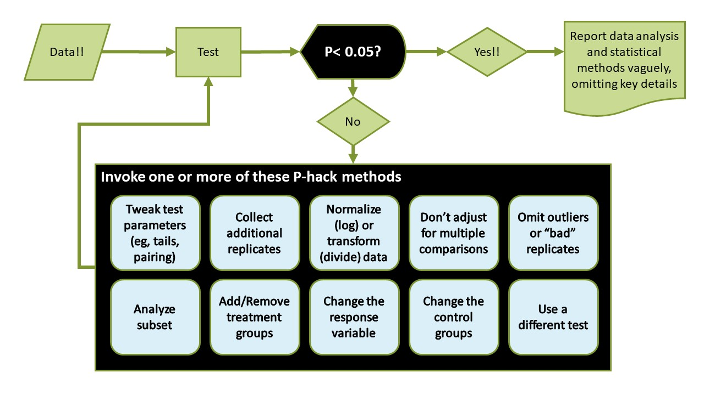
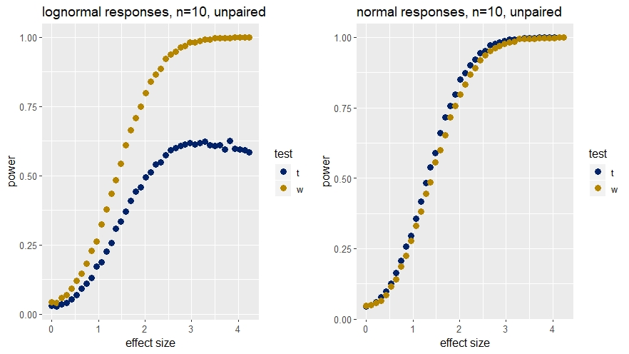

# The t-tests {#ttests}

```{r message=FALSE, warning=FALSE, include=FALSE}
library(tidyverse)
library(pwr)
library(car)
library(broom)
library(cowplot)
```
Easily, in the biomedical science world t-tests are the most used and abused of all of statistical tests.

The t-tests are for hypotheses comparing responses of either

* one group to a nominal standard or 
* two groups to each other, or 
* paired measures within replicates. 

Use the t-tests when the dependent variables are continuous measured data and when two or fewer levels of discrete (factorial) independent variable are tested. See Chapter \@ref(data) to understand what is meant by continuous measured data.

A common misuse of t-tests are for experiments where the dependent variables are discrete sorted or ordered values.

The menagerie of ANOVA posthoc tests go by various names, but most are fundamentally close cousins of t-tests.

## Assumptions for t-tests

The following assumptions should be checked to use t-tests properly.

### Strong assumptions, t-tests are invalid if these not met:

1) The replicate data arise from a randomized process.

2) Each sample replicate is independent of every other sample replicate.

A randomization process in the experimental protocol ensures that [the distribution of residual error across the groups is truly random](https://errorstatistics.com/2020/04/20/s-senn-randomisation-is-not-about-balance-nor-about-homogeneity-but-about-randomness-guest-post/).

Don't confuse a measurement with a replicate. Paired designs have two measurements from one replicate. These two measurements are not independent. See Chapter \@ref(sampling).

### Weak assumptions: t-tests are less robust when these are not met:

3) The residual error of the measurements for each group is approximately normally distributed.

4) The variances of the compared groups are equivalent.

### On random residual error

We have arrived at the simplest application of the linear model. Wherein one level $x_1$ or  two levels $x_1,x_2$ of the independent variable $X$ predicts the expected response of the dependent variable $Y$ as

\begin{equation}
E(Y) = \beta_0 +\beta_1X+\epsilon
(\#eq:lm)
\end{equation}

The focus of t-testing is to estimate for the value of $\beta_1$ to ask whether it differs statistically from zero. When $\beta_1=0$, a line drawn between the pair of points $x_1,y_1$ and $x_2, y_2$ has a slope of zero. This indicates $X$ has no effect on $Y$ and thus $E(Y)$ equals the value of the intercept, $Y = \beta_0$. 

Think of $\beta_0$ as the background or basal or control level the dependent variable. $\beta_1$ is the magnitude of the change in the dependent variable caused by one unit of $X$. 

We assume that both population parameters $\beta_0$ and $\beta_1$ have fixed values...but we don't know for sure what those values are (that's why they are in Greek letters). Our job as researchers is to use sampling-based experiments to estimate these fixed values. 

Let's say I come up with the following estimates for the betas. Then I want to run an experiment to determine values of $Y$ in response to two different values of $X$. I just run it as an R code model.

```{r error-free linear model}
beta0 <- 1
beta1 <- 2
X <- c(1 , 2)
Y <- beta0 +beta1*X
Y
```

That's a perfect model and it generates perfect data. Every time I run the chunk I get exactly the same result. Perfectly. There is no variation.

Of course, data are never that perfect in real life. 

Real life data has noise. In statistical jargon noise is called residual error. Residual error is, simply, an accounting trick. It is a way to account for all the sources of variation in our data that our perfect model parameters fail to explain. 

The source of this unexplained variation could be biological, or it could be measurement error, or it could be both. Who knows? If we knew what caused it we would explain it by putting it in our model as another variable, like $Z$, and another parmeter, like $\beta_2$. But we can't explain it other than to blame it on random. So we account for it in the linear model using the epsilon $\epsilon$ term.

Gauss discovered that a property of continuous data is that residual error, $\epsilon$, [tends to be normally distributed.](https://www.maa.org/sites/default/files/pdf/upload_library/22/Allendoerfer/stahl96.pdf)

The R code model is updated below to account for residual error. Notice how we're adding a term to the model. This term is the random normal $N(\mu=0,\sigma=1)$ and it represents the residual error term, $\epsilon$, from equation\@ref(eq:lm).

If we run that model, you get a different result every time...due to the random normal term. Our only explanation for the variation is that it comes from a random normal process. This is why incorporate a protocol in our experimental design to allocate treatments using some random process! 

```{r linear model with random normal error}
# everytime you run this chunk you'll get a different outcome
Y <- beta0 +beta1*X + rnorm(length(X))
Y
```

### On the normality assumption

The normality assumption for t-testing (and other parametric statistical testing) is really about the normality of the residual error in the sample. 

All parametric models have a random normal term $\epsilon$ to account for that which we cannot yet explain with other model parameters. $\epsilon$ modifies the influence of the beta coefficients on the values of $Y$ generated by the model. $\epsilon$ accounts for the unexplained variation in the data.

#### Usually it is hard to verify normality

Pragmatically, assessing whether the distribution of $\epsilon$ is normal from small sample sizes is difficult. Which makes it hard to validate the weaker two assumptions above.

As a researcher, particularly a small sample researcher, there are two ways to approach these weaker assumptions.

The first is to just assume normality and not worry about it. This tends to be a safe bet when working with measured variables, particularly when we're confident that we are working within their linear range. Further, at the core of the t-test and other parametric statistics are frequentist assumptions based upon the distributions of means. The distributions of means ARE normally distributed via the central limit theorem.

The second approach is to run normality tests and then act on those test results. That action is either a data transformation or a data exclusion decision.

Normality tests such as the Shapiro-Wilk (`shapiro.test`), tests the null hypothesis that the values of a random variable are normally-distributed. Levene's test `car::leveneTest` is useful to test the homogeneity of variance assumption. 

#### On dealing with outliers

If the nulls of the Shapiro or Levene tests are rejected, something must be done. The data might be normalized through log or reciprocal transformation. Then run the t-tests on these transformed values. If the measurement data include values of zero, something must be done that in the transformation protocol. 

Or the test result triggers an outlier removal protocol. 

Alternately, the decision tree calls for reverting to nonparametric analysis with the Wilcoxon tests instead of t-tests. See Chapter \@(nonparametrics) for those.

I'm not a fan of these "normality" tests. The smaller the sample size, the more suspicious I am of their utility or that I have enough information to heed the weaker assumptions. That's mostly why I don't teach them in the course. The other big reason is that, in practice, these decision trees tend to be made up as you go rather than pre-planned protocol. That's hacking.

If you actually wrote these into the statistical design in advance, it would read pretty hackish, too. Something like this: "then I will do normality tests, and if normalization doesn't fix the problem, I'll start tossing data..."

What most are really asking from a normality test is for permission to p-hack, perhaps hoping to rescue "statistical significance" from an otherwise moribund result. 

```{r p-hacking, fig.cap="This is p-hacking. Uncritical allegiance to t-testing's weaker assumptions is frequently a gateway to an integrity crisis."}

```

#### On nonparametrics 

The performance of t-tests compared to their nonparametric counterparts are virtually identical when the normality and homoscedasticity assumptions are met (see the right panel in the next graph).  

The t-tests are generally held to be robust (aka, perform well) to violations of the weaker assumptions. But YMMV.

Here's an illustration for when t-tests are not robust. The panel on the left shows a scenario where the data is lognormal and the nonparametric test has far greater power than the t-test to detect true differences.

```{r  echo=FALSE, fig.cap="Comparison of Wilcoxon test (w) power to t-tests when sampling from skewed (lognormal) and normal distributions."}

```

What's right for you? It depends on your experimental design and the data you intend to collect (ie, how much it diverges from normality), and what you believe to be a scientifically significant result. 

Take some time to learn the Monte Carlo simulation method. If you expect deviant data, model the deviant data as best you can in these simulations. Compare different ways for a statistical analysis of the simulated "outcome" data. Do this in advance. And then go run the experiment.

## The t Statistic

The $t$ statistic is a ratio signifying the signal to noise ratio in a sample. See Chapter \@ref(tdist) for the distribution functions that help understand more about its properties.

The numerator of $t$ is a measure for the magnitude of the average effect, whereas the denominator represents the precision by which those mean differences are determined. 

I show below 4 different ways to calculate $t$, which correspond to three very different experimental designs (the unpaired design has two ways to calculate $t$). 

The decision to use one or the other t-tests is based upon how the experiment is conducted. If we understand our experimental design, we'll know which t-test is applicable.

The three t-tests answer fundamentally different questions:

* One sample tests inspect the difference between a sample mean and a hypothetical mean. 
* Unpaired tests inspect the difference between the means of two groups. 
* The paired t test inspects the mean of the differences between paired observations.

*The most common mistake made by statistically naive researchers is running unpaired t-tests on experiments that have a paired design.*

## One sample t tests

This is for analyzing experiments comparing the mean response $\bar y$ evoked by a single level of a predictor variable to a hypothetical population mean of that response, $\mu$. 

The group is comprised of $n$ independent replicates, one measurement per replicate. The mean of the replicate measurements is $\bar y$.  The one sample t test has $n-1$ degrees of freedom.

\begin{equation}
  t=\frac{\bar y-\mu}{\frac{sd}{\sqrt n}}
  (\#eq:tone)
\end{equation}

### Example

Everybody accepts that the mean normal blood glucose level in mice is 100 mg/dl. In an experiment blood glucose is measured in a random sample of 12 mice in which the insulin receptor gene has been disrupted. A one-sample t-test compares the mean of these measured glucose values to the nominal value, $\mu$=100 mg/dl. The experiment has 12 independent replicates and the t-test has 11 degrees of freedom. 

## Unpaired t tests

This test is used for experiments in which the replicate measurements are all independent from each other.

There are two ways to calculate $t$ for these designs.

### Student's t-test

The unpaired Student's t-test compares the difference between the mean responses for each of two levels, A and B, of an independent variable. The design is comprised of a total of $n_A + n_B$ observations. A degree of freedom is lost for each of the two calculated group means, thus the t-statistic has $n_A + n_B-2$ degrees of freedom. $s_p$ is the pooled standard deviation of the sample. $s^2_p$ is the pooled variance of the sample.

\begin{equation}
  t=\frac{\bar y_A-\bar y_B}{\sqrt{\frac{s^2_p}{n_A}+\frac{s^2_p}{n_B}}}
  (\#eq:stup)
\end{equation}

The pooled variance is calculated using the sum of the squared deviates $SS_A\ and\ SS_B$ from each group as follows:

\begin{equation}
  s^2_p=\frac{SS_A+SS_B}{df_A+df_B}
  (\#eq:poolvar)
\end{equation}

where $df_A=n_A-1$ and $df_B=n_B-1$.

The denominator of the $t$ ratio is the standard error of the test. The standard error represents the test's precision but note how it represents the standard error for two means.

Inspection of the pooled variance equation and how it factors into the calculation of the test statistic should give you some indication for how unequal sample sizes or unequal variance between groups can be problematic. When unbalanced the calculation can be biased to one of the groups.

### Welch's t-test

Welch's test differs from Student's t-test and so will generate different output. First, Welch does not use a pooled variance term.

\begin{equation}
  t=\frac{\bar y_A-\bar y_B}{\sqrt{\frac{s^2_A}{n_A}+\frac{s^2_B}{n_B}}}
  (\#eq:welch)
\end{equation}

Second, the degrees of freedom $\nu$ for the null $t$ distribution of the test is calculated differently: 

\begin{equation}
  \nu=\frac{(\frac{s^2_A}{n_A}+\frac{s^2_B}{n_B})^2}{\frac{s^4_A}{n^2_A\nu_A}+\frac{s^4_B}{n^2_b\nu_B}}
  (\#eq:welchdf)
\end{equation}

#### Which is better?

In R's `t.test` function the default option `var.equal=F` calls for Welch's test. When set to `TRUE`, it runs the unpaired Student's t-test. 

Under some conditions, the two tests can yield quite different values for $t$ and thus $p-values$. The Welch t-test is held to perform better under a variety of sampling conditions, but such generalities are not as useful as you might think. YMMV. 

When conducting Monte Carlo analysis during the experimental design phase, particularly when planning unequal sample sizes or for unequal variances, it is useful to compare how Welch and Student's perform against each other. Waiting until after the data have arrived to see which performs better is p-hacking. Figure it out in advance.

### Example

Irrespective of choosing to analyze the data using Welch's or Student's t-test, the experimental design is the same. 

A mouse model of diabetes has been established. It is used to test whether novel blood glucose lowering drugs work. A sample of 28 mice are randomly assigned to treatment with either a placebo $n$=14 or with a drug$n$=14. Blood glucose measurements are taken from all mice. Every measurement is independent of all other measurements. There are two means: $\bar y_{placebo}$ and $\bar y_{drug}$ . 

The numerator of the t-statistic is the difference between these two group means. The denominator will be either Student's or Welch's way of calculating the standard error $se$. The degrees of freedom will differ also, depending upon whether Student's or Welch's test is used.

## Paired t tests

This test is used when measurements are intrinsically-linked. 

Each of $n$ replicates is exposed to both levels, A and B, of a predictor variable. There are $n$ pairs of measurements in the design. The mean difference $\bar d$ of the paired responses is compared to the value of zero. $sd_d$ is the standard deviation of the $n$ differences. The experiment has $n-1$ degrees of freedom, because only the mean of the differences is taken.

\begin{equation}
  t=\frac{\bar d}{\frac{sd_d}{\sqrt n}}
  (\#eq:tpair)
\end{equation}

### Example

A random sample of 14 diabetic mice is selected from a colony. In a classic before and after design, for each mouse a blood sample is drawn after administration of a placebo. Blood glucose is measured in the sample. Each mouse is next administered a drug. Later, a second blood sample is drawn, in which glucose is measured again. 

There are 28 measurements. The difference in blood glucose between the two measurements is calculated within each mouse. There are 14 differences. The mean of those differences, $\bar y_{diff}$ is the numerator of the t statistic. The denominator is the standard error of the mean of the differences, $semd$. The total sample size $n$=14 and the test has 13 degrees of freedom. 

Each __pair__ of measurements stands as one independent replicate.

## t Test Hypotheses

The choice of t-test hypotheses depends upon the experimental design and the scientific question at hand. In R, the hypothesis is set via options in the `alternative` argument of the `t.test` function.

Since t-tests are parametric, hypotheses are stated on the basis of the statistical parameters of the sampled population. In this case, the means of the samples are meant to infer the sampled population, so we revert to Greek notation. 

To put this another way, that the sample shows a difference is a mathematical fact. We don't need a statistical test to tell us that. The test helps us to infer from the sample of differences whether the populations that were sampled differ.

One-sided hypotheses predict the direction of an effect. For example, "the response to treatment will be greater than placebo." Or, "the response to treatment will be less than placebo." 

Two-sided hypothesis do not predict the direction of an effect: "The response to treatment will differ from control, either higher or lower." 

Therefore, we use a one-sided hypothesis if we think our treatment will go in a specific direction. We choose a two-sided test when we're not willing to bet on an effect's direction.

This matters because at the 95% confidence level the threshold value of the t statistic will be lower for a one-sided test ( eg,`qt(0.05, 2`) than for a two-sided test (`qt(0.05/2, 2)`) given the same data. Put another way, the "significance" threshold will always be a higher bar to cross for a two-sided hypothesis. For a one-sided test, all of the 5% cumulative probability is on one side of the distribution. For a two-sided test, that 5% is evenly split to both sides. 

Therefore, two-sided tests are slightly more stringent. 

## One-sided or two-sided??

There is a school of thought that all testing should be two-sided. One reason for this is the enhanced stringency. Another is that confidence intervals of the estimate are more readily interpretable because they have both upper and lower bounds. You'll soon see (or noticed when we were in the nonparametrics) that one-sided tests have only one bound, the other side being infinite. Those are harder to interpret. A third reason is that when testing one-sided and the effect goes extreme but in the direction opposite of predicted, the null cannot be rejected formally. No inference could be made, formally.

On the other hand, one-sided hypotheses feel very normal. We usually have good scientific rationale for expecting a treatment to be larger (or smaller) than a control. Why shouldn't we test that statistically?

To keep the stringency of the two sides, we can run the one-sided t-test at `conf.level=0.975`. Problem solved. 

To have a 95% CI with upper and lower bounds we can always calculate and report one: __"...has mean glucose of 100 (two-sided 95% CI 90 to 100, one-sided t-test, p = 0.024)"__ We use the p-value for inference and the CI to report on the accuracy of the point estimate. That's a bit clunky, but problem solved.

I don't have an easy solution for the third point. If we start an experiment testing "greater" but the data show a statistical difference that is "less", then we should admit we are wrong. Sorry. To do otherwise is to invoke the HARK bias, "hypothesizing after receiving knowledge". 

### One sample hypotheses

Two sided: Use when, going into an experiment, you are not sure which direction the predictor variable will change the outcome variable relative to the population mean.

$H_0: \bar y = \mu$
$H_1: \bar y \ne \mu$

One sided: Use when, going into an experiment, you are confident the predictor variable will cause the outcome response to be higher than the population mean.

$H_0: \bar y \le \mu$
$H_1: \bar y > \mu$

Or you are confident the predictor variable will cause the outcome response to be lower than the population mean.

$H_0: \bar y \ge \mu$
$H_1: \bar y< \mu$

### Unpaired hypotheses

Two sided: Use when, going into an experiment, you are not sure whether level A or B of the predictor will cause a higher outcome response.

$H_0: \bar y_A = \bar x_B$
$H_1: \bar y_A \ne \bar x_B$

One sided: Use when, going into an experiment, you are confident level A of the predictor variable will cause the outcome response to be higher than that for level B. 

$H_0: \bar y_A \le \bar x_B$
$H_1: \bar y_A > \bar x_B$

Or when you are confident the level A of the predictor variable will cause the outcome response to be lower than that for level B.

$H_0: \bar y_A \ge \bar x_B$
$H_1: \bar y_A < \bar x_B$

### Paired hypotheses

Two sided: Use when, going into an experiment, you are not sure whether the mean difference between levels of the predictor variable will be less than or greater than zero. 

$H_0: \bar y_{diff} = 0$
$H_1: \bar y_{diff} \ne 0$

One sided: Use when, going into an experiment, you are confident the mean difference between levels of the predictor will be greater than zero. 

$H_0: \bar y_{diff} \le 0$
$H_1: \bar y_{diff} > 0$

Or when, going into an experiment, you are confident the mean difference between levels of the predictor will be less than zero.

$H_0: \bar y_{diff} \ge 0$
$H_1: \bar y_{diff} < 0$

## Confidence Intervals

A confidence interval has duality. It is an inferential statistic that also allows for providing some insights as to the accuracy of a sample. 

A two-sided 95% CI can be calculated as follows:

\begin{equation}
\bar y \pm qt(0.975, df)*\frac{sd}{\sqrt n}
(\#eq:ci)
\end{equation}

For example, given a sample size of n=3, the mean is 100. and the standard deviation is 25:

```{r}
upper.limit <- 100+qt(0.975, 2)*(25/sqrt(3))
lower.limit <- 100-qt(0.975, 2)*(25/sqrt(3))
paste("upper limit=", upper.limit)
paste("lower limit=",lower.limit)
```

Thus, the point estimate for the mean is 100 and, _on the basis of this single sample_, we can assert 95% confidence the true population mean lies between 37.89 and 162.10.

A slightly more accurate way to think about this is in frequentist terms. If we sampled 100 times, where each sample has n independent replicates, 95% of the resulting confidence intervals would include our point estimate of 100, but their point estimates could range from 37.89 to 162.10. 

The CI is useful inferentially. For the hypothesis rejection decision, the CI provides the same information as the p-value.

For example, imagine the sample mean from above (100, 95% CI 37.89 to 162.10) comes from an experiment to test the hypothesis that the mean differs from zero ($H_0:\mu=0$). Since the CI does not include 0, we can reject the null. We would also find a p-value less than 0.05 would be associated with this outcome.

In contrast, if we have a mean of 69 and a 95% CI of -12.1 to 150 that includes the value of zero. In that case, even though our point estimate is 69, we have 95% confidence a value of zero for our point estimate is possible. The null would not be rejected. And you would find a p-value > 0.05 associated with this outcome

The CI should also be interpreted scientifically. The CI range may include values that are scientifically unimpressive. For example, the point estimate for the population mean from the sample is 100. There is 95% confidence the other values in the interval may also explain our variable, too. Perhaps we don't think much, scientifically, of values that are 40 or lower? Yet, since they are in the interval they raise concerns about the scientific quality of the sample, including the point estimate.

I like to think that the standard error of the mean, $SEM$, or $\frac{sd}{\sqrt n}$, provides information about the precision of the mean estimate. As the sample size increases $SEM$ lowers. As we sample more, our estimate of the mean gets more precise.

I like to think about the 95% confidence interval as providing information about the accuracy of the mean; the range of values for what the true mean _might_ be based upon this one sample. The CI tells us not to fall in love with the point estimate...the CI is a range of values that make just as much sense.

Of course, when sampling from unknown hypothetical populations it's never possible to know if something is accurate with perfect certainty. However, it is useful from time to time assert how confident we are in an estimate in terms of the values it might otherwise taken on.

Therefore, be less concerned about whether a CI is wide or narrow. That is not the right question to ask. Be more concerned about whether the CI includes values that don't impress scientifically. That thinking provides a check against blind obedience to a p-value.

## Reliability of small samples

The t-tests are based upon the sample parameters $\bar y, n, sd, where\ sem=\frac{sd}{\sqrt n}$. Furthermore, it is very common to base relatively small experiments on the t-test experimental design. 

At this stage we know enough to make worthwile pointing out the relationship between sample size and the properties of these parameters.

The figure below illustrates the outcome of repeated random sampling from the __known__ population $N(\mu=100, \sigma=25)$. The coefficient of variation for this simulation is $cv=\frac{\sigma}{\mu}=0.25$, which my sense says is pretty typical for bio-variable with a well behaved signal to noise ratio. But YMMV.

At first, this script samples at size $n=2$, repeating the sampling 50 times. For each of these 50 samples it calculates the sample $\bar y$, $sd$, and $SEM$. Then it moves up to a sample size of $n=3$, collecting these parameter values from each sample. And so on and so on up to a sample size of $n=100$

```{r echo=FALSE, fig.cap="Simulation of the relationships between the sample parameters used in t-tests. These can represent either group parameters or the parameters for the difference between groups."}
# a function to calculate parameter values for each sample drawn.
sampler <- function(n) {
  samp <- rnorm(n, 100, 25)
  msamp <- mean(samp)
  sdsamp <- sd(samp)
  sesamp <- sdsamp/sqrt(n)
  tibble(n, msamp, sdsamp, sesamp)
}
# apply sampler to a column of n's, by row
sampsize <- tibble(n=2:100)
test <- bind_rows(apply(sampsize, 1, sampler))
# repeat 50X per n, the parameters in a list of lists
outputs <- list()
for (i in 1:50) {
  output <- bind_rows(apply(sampsize, 1, sampler))
  outputs[[i]] <- output
}
# tidyverse magic, converts list of lists to data frame
outputs <- bind_rows(outputs)
# plot it!
ggplot(outputs)+
  geom_point(aes(n, msamp), color="blue", alpha=0.1)+
  geom_point(aes(n, sdsamp), color ="red", alpha=0.1)+
  geom_point(aes(n, sesamp), color="black", alpha=0.1)+
  ylab("parameter value")+
  annotate(geom="text", 
           x=c(75,75, 75), 
           y=c(125,40, 12), 
           label=c("mean","sd", "sem"),
           color=c("blue", "red", "black"),
           size=8
           )+
  theme_bw()
```

This result illustrates two big things. 

First, small samples are crappy. 

Since we coded the values we __know__ the mean and standard deviation are 100 and 25, respectively. Yet, at low sample sizes, $n$, a random sample can often be pretty far off. And these vary quite a lot, too.  

In real life, we'd never know whether our small sample is yielding a crappy estimate for a population parameter!

The researcher is not at fault for this. This is the luck of the random draw. This happens even with exquisite technique and perfectly calibrated pipettes and other instrumentation, and slavish attention to detail. 

Biological systems have variance. Variance can cause our sample estimates to be far off from the central tendancy.  

When exactly do small samples get less crappy? In some respects that is in the eye of the beholder. To my eye, for this case $n >30$ seems less crappy than under 30. 

Importantly, the coefficient of variation will have a big role in this. Small samples of variables with low $cv$ will be less crappy, relatively speaking. And the larger the effect size the greater latitude we have in tolerating crappy small samples, irrespective of their $cv$. 

__This is where power calculations come in very handy. They are designed to tell us how low our sample size can be before we become victims of the craptastic.__

The second thing big thing this illustrator reveals is that $sd$ and $sem$ are not telling us the same thing.  

The sample $sd$ measures dispersion in the sample, but that is also an estimate of $\sigma$, the dispersion in the population. This is in the same way that the sample mean $\bar y$ estimates the population mean $\mu$. 

As sample size increases the $sem$ gets lower and lower. That is due to math because $sem=\frac{sd}{\sqrt n}$. 

The $sem$ in fact is the standard deviation of a theoretical population of sample means. This concept is derived from the central limit theorem^[In fact, the `sampler` function basically simulates the central limit theorem. Each blue point is a mean. Imagine calculating the mean and standard deviation of the 50 blue means at each value of $n$. The standard deviation of the 50 means at each $n$ is the $sem$!]  

As a result, we infer from the $sem$ of a single sample how precisely that sample estimates the population mean. As you can see from this illustrator, the precision by which a mean is estimated improves as the sample size used to estimate that mean increases. Whereas $sd$ oscillates with each sample around a fixed value, like the mean, reflective of the dispersion of values in the population, $sem$ gets better and better (when one assumes low is better).

### Reporting SD or SEM?

When the precision of a measurement is important, show the $sem$, and be sure to provide the sample size as well. For everything else just report the $sd$.

Are you estimating the value of a physical constant, such as the mass of a boson, the $K_D$ of a drug receptor interaction, the $K_M$ of an enzyme for a substrate? Something that should have the same value no matter where in the universe it is estimated? Researchers who are in the business of estimating those values with high precision, such as when those values are under dispute, cannot be faulted for reporting the $sem$. Particularly when the goal of the experiment was to get a better estimate of the physical constant or how a variable changes it. In those cases, precision is more important. 

The $sd$ estimates the dispersion of the population while also providing insight into the variability of the sample. The illustrator above proves the $sem$ does neither. The reader of your research is usually far better served by getting dispersion information. For example, they may want to replicate your results but need to do a power analysis first.

When you're reporting relative transformations (percent of control, fold, etc) the $sem$ is useless. It is hard to imagine cases where precision has much utility to understand effects written in those units.

Another consequence of the so-called replication crisis is that journals are requiring authors to show all their data more openly. For example, they ask for users to report data as scatter plots to show all data points rather than bar graphs with error bars. 

Most people who are honest about why they use $sem$ error bars in graphs admit it makes the data look better. Although honest about their reasons, and naive because they don't really understand the difference between $sd$ and $sem$, that motivation is basically deception.

Finally, if you do use SEM in bar graphs, then you must report the exact value of $n$ for each group so a reader can back calculate out the $sd$. This can get messy fast for all but the simplest graphs and figure legends.

Do your reader a favor and just report the $sd$.

## Running the analysis in R

In R `t.test` represents a single function by which each of the three t test experimental designs can be analyzed.

### One sample t test

Let's say a standard to measure against is the value of 100. We can ask if a random sample that is 2-fold greater is different than 100, less than 100, or greater than 100:

```{r}
# this makes the sample reproducible
set.seed(1234)
# here's a random sample
a <- rnorm(3, mean=200, sd=25)

# you can run t.test without naming it as an object
one2 <- t.test(a, mu=100, alternative="two.sided", conf.level=0.95 )
oneL <-t.test(a, mu=100, alternative="less", conf.level=0.95)
oneG <- t.test(a, mu=100, alternative ="greater", conf.level=0.95)
# the following line makes jabstb more readable
# broom::tidy is a function to clean up R test output
# not a bad trick to have for functions or writing clean reports 
knitr::kable(bind_rows(tidy(one2), tidy(oneL), tidy(oneG)), 
             caption="One-sample t-test output. Read text for interpretation.")
```

#### Interpretation of one-sample output

* $t$ is a descriptive statistic, calculated from the sample values [as described above](### One sample t tests). The test uses ordinary least squares. See [the chapter on dispersion](#dispersion).

* Notice how the t-value is the same for all 3 tests. The same sample will give the same signal to noise ratio, irrespective of the hypothesis tested.

* You may be disappointed by no output for the $sd$ or $sem$ of the sample. But these are easy enough to calculate. From the equation [as described above](### One sample t tests): $sem=\frac{\bar y}{t}$, and $sd=sem \times \sqrt n$

* Parameter is value for the degrees of freedom. This sample with $n=3$ has $df=2$. A degree of freedom was lost in calculating $\bar y$

* The p-value is a cumulative probability from a null $t_{df=2}$ distribution. It is the probability of the observed value for $t$ or a value more extreme, if the null hypothesis is true.

* The p-values do differ between the 3 tests because the hypotheses differ, and these hypotheses affect the calculation of $p$ even though $t$ is the same for each test. 

* The one-sided `less` hypothesis argument predicts the sample mean will be less than $\mu$. Its p-value calculation is `pt(q=6.037536, df=2, lower.tail=T)`. It is large because it is the wrong hypothesis for these data. If the sign of the $t$ were negative, this would be the correct hypothesis.

The one-sided `greater` hypothesis greater predicts the sample mean will be greater than $\mu$. Its p-value calculation is `pt(q=6.037536, df=2, lower.tail=F)`. 

* The `two.sided` hypothesis is the sample mean does not equal $\mu$. Its p-value is `pt(t=6.037536, df=2, lower.tail=T)/2`

* The 95% confidence level is the default. If you want a different confidence level, for example, an 86.75309% CI, simply enter an argument for it.

* The upper and lower confidence limits differ between the 3 tests. The one-sided tests give you an infinite limit on one side. These are hard to interpret and not particularly useful. If you are tempted to to combine the upper of less with the lower of greater, you've created a 90% confidence interval, so don't.

* The simplest way to get a "typical" 95% CI in R that has both upper and lower limits is to run a two.sided t.test and pull it out of that.

### Unpaired t test

Now we will pull two random samples: one from a normal distribution that has a mean of 200, and the second from a distribution that has a mean of 100. Both have standard deviations of 25. We have the option to run three different hypotheses.

```{r}
set.seed(1234)
a <- rnorm(3, mean=200, sd=25)
b <- rnorm(3, mean=100, sd=25)
up2 <- t.test(a, b, alternative="two.sided", var.equal = F )
upL <- t.test(a, b, alternative="less", var.equal = F)
upG <- t.test(a,b, alternative ="greater", var.equal = F)
knitr::kable(bind_rows(tidy(up2), tidy(upL), tidy(upG)), 
             caption="Unpaired t-test output. See text for interpretation. See interpretation of one-sample tests for details omitted here common to all tests.")   
```

#### Interpretation ot unpaired output

* The interpretation is is similar to the one sample case, so I won't repeat a lot of that, but there are some evident differences.

* The estimate now is the difference between the means of each group.

* Estimate1 and estimate2 are the means of each group.

* Statistic is the value of $t$, in this example calculated by the default [Welch method](#### Welch's t-test). That arises from the default `var.equal=F` argument in the test function.

* Parameter is the value for degrees of freedom $df$,in this example also calculated by the [Welch method](#### Welch's t-test). These are almost always fractional, which the Welch formula for calculating $df$ predicts, whereas $df$ for the Student's t-test is always an integer value.

* Although you can calculate the standard error for the test, $se = \frac{estimate}{statistic}$, because there are two means, note how this value is not a standard error of the mean. In fact, each group will have different $sem$ values. Best use R to calculate sem per group: `sem <- sd(a)/sqrt(length(a))`

* The "mean of x" corresponds to the `a` sample, or the first group in the argument. In the unpaired t test, good practice is to put the 'treatment' as the first data argument, and the 'control' as the second argument.

* That will make interpretation of one-sided test output a LOT easier.

* Welch's test is only for unpaired tests, because it serves as an adjustment for when the sample sizes and variances of the two groups differ. The one-sample doesn't have two groups, whereas the group variances are completely irrelevant in the paired t-tests.

### Paired t Test

The paired test calculates the differences between paired measurements. Then it asks how the mean of these differences differs from zero. 

In fact, although two levels of a predictor variable are involved, there are not two groups of replicates. There is only one group. The test calculates the mean and its standard error for the differences between matched measurements within each replicate. The test asks, "what is the relationship of these differences to zero?" Thus. it is much more like the one-sample t-test than it is like the unpaired t-test. 

The structure of the data input matters strictly. If entered as two vectors (like below), the first value of the first vector will be paired with the first value of the second vector, and so on. 

Alternately, like all t-tests, you can run it using the formula method, which reads columns from a tidy dataframe. Good practice is to include replicate id's in these data frames. Though not necessary to run the t-test, replicate ids are necessary to plot the results correctly.

```{r}
set.seed(1234)
a <- rnorm(3, mean=200, sd=25)
b <- rnorm(3, mean=100, sd=25)
p2 <- t.test(a, b, alternative="two.sided", paired=T)
pL <- t.test(a, b, alternative="less", paired=T)
pG <- t.test(a, b, alternative ="greater", paired=T)
#make a data frame suitable for the formula argument
long <- tibble(replicate_id=1:3, a, b) %>%  
  pivot_longer(-replicate_id, 
               names_to="predictor", 
               values_to="response")
#running the formula argument
l2 <- t.test(response ~ predictor, data=long, alternative="two.sided", paired=T)
knitr::kable(bind_rows(tidy(l2), tidy(p2), tidy(pL), tidy(pG)), 
             caption="Paired t-test output. See text for interpretation. See interpretation of one-sample tests for details omitted here common in all tests.")
```

#### Interpretation of paired output

* The first row of the output is from the formula test. It should have the same everything as the second row. The formula method is a less old school data input method, and has no other effect on the test.

* The estimate is the mean of the differences between pairs. Group means are irrelevant. What matters in a paired t-test is whether the differences are reliably different from zero.

* Notice how, given the same data, the paired computes a higher value for $t$ compared to the unpaired.

* $t$ is the ratio of the mean of the differences divided by the standard error of the mean of the differences.

* Notice how, given the same data, the paired test computes a lower p-value compared to the unpaired.

* The 95% CI is for the mean of the differences. There is 95% confidence the true mean of the differences in the population sampled is included within the range bounded by conf.low and conf.high.

* The parameter is the degrees of freedom. In this sample $df=2$ because there are 3 pairs. A degree of freedom was lost by calculating the mean of the differences.

* The paired test has the same number of measurements as the unpaired test, but fewer independent replicates. This is due to the experimental design, which called for paired measurements from each replicate. Which is based entirely upon scientific judgment.

* There is no Welch's test for paired measurements. Welch is all about two groups. There is only one group of replicates in a paired t-test design.

* Good statistical judgment is to not conflate the paired and unpaired tests, or to assume they differ trivially, or to assume one is a simple analytic difference from the other. They differ dramatically. 

## Plotting t Tests

Plot t-tests in a way that illustrates the experimental design.

### One-sample

The one-sample t-test compares a group mean to a reference value. So the plot should only show one group, ideally as scatter points instead of a bar graph. The reference value should be highlighted. A geom to illustrate the mean and standard deviation or confidence interval is a nice touch.

```{r}
# the values for a were created in a code chunk above
data.o <- tibble(treatment=a)
```

The main trick here is to code a dummy factorial variable for the x-axis within the ggplot aesthetic.

```{r fig.cap="Plotting one-sample t-test data", message=FALSE, warning=FALSE}
# note dummy x axis variable
# reference value is 100
ggplot(data.o, aes(x=factor(1), y=treatment))+
  stat_summary(fun.data = mean_sdl, 
               fun.args = list(mult=1), 
               geom="crossbar", 
               width=0.1, 
               color="red"
               )+
  geom_point(size=4)+
  geom_hline(aes(yintercept=100), 
             color="blue", size=2, 
             linetype="dashed")+
  scale_y_continuous(limits= c(50, 250))+
  labs(x="treatment")
```

### Unpaired

An unpaired t-test compares two means. So the plot should show two means.

Tidy the data, which makes it simple to create a descriptive statistics summary table:

```{r summary stats for unpaired t}
# munge data that was simulated above
data.u <- data.frame(replicate=1:6, control=b, treatment=a) %>%
  pivot_longer(cols=c(control, treatment),
               names_to="Predictor",
               values_to="Response")
#summary statistics table to have
data.y <- data.u%>%
  group_by(Predictor) %>%
  summarise(
     mean=mean(Response),
     sd=sd(Response),
     n=length(Response),
     sem=mean(Response)/sqrt(n),
     .groups = "drop"
     
           )
knitr::kable(data.y, 
             caption="Summary statistics for a two group sample.")
```

Unless there is a scientific reason to report precision (and there rarely is a good reason to show the standard errors of the means) plot the data points with mean +/- standard deviation.

A straight forward ways to add error bars is by use of the `stat_summary` function. A few ways exist to do this. I use the `crossbar` geom because it is a bit quicker. Note the `mean_sdl` is from the `Hmisc`package. The package has related funtions for standard error and confidence intervals.^[I've seen several instances where Hmisc functions throw errors on the machines of some students. These errors have not been reproduced by the package author, so they remain unresolved. When `mean_sdl` doesn't work the parameter values can be computed readily.] 

```{r fig.cap="Journals want data as scatter plots. Stat_summary geoms add error bars. The argument mult=1 coupled with mean_sdl function draws +/- 1 SD"}

ggplot(data.u, aes(Predictor, Response)) +
  geom_jitter(width=0.15, size=4) + 
  stat_summary(fun.data = mean_sdl, 
               fun.args = list(mult=1), 
               geom="crossbar", 
               width=0.2, 
               color="red"
               )
  # or if you prefer
  # stat_summary(fun.data="mean_sdl", fun.args=list(mult=1), 
  #              geom="errorbar", color="red", width=0.2) +
  # stat_summary(fun.y=mean, geom="point", color="red", shape="plus", size=5)
```

### Paired

In the paired experimental design, each replicate is a pair of observations. Plots with point-to-point lines will illustrate the paired relationship of the measurements.

The means of the two groups of observations are irrelevant. The difference between each pair of observations is relevant. The mean of these differences is also relevant

The design tests for the *difference* the treatment causes within each pair, which the slope of the line illustrates. For example, a horizontal line connects a replicate pair would indicate no effect of the predictor variable!

Munge the data into a long data frame format. Adding an ID for each replicate is necessary as a grouping variable. This grouping variable is used to connect point pairs with a line and to calculate differences between pairs.

```{r long format paired data}
# the response values a and b were simulated above

data.w <- tibble(control=b, treatment=a, id=c("A", "B", "C")) %>%
  pivot_longer(cols=c(control, treatment),
               names_to="Predictor",
               values_to="Response")

```

The grouping variable is also used for creating a second plot to illustrate the computed values of the differences. 

```{r calculates paired differences}
data.wd <- data.w %>% 
  select(id, Predictor, Response) %>% 
  group_by(id) %>% 
  summarise(dif=diff(Response),
            .groups="drop")

data.wd
```

The code and the proper way(s) to plot the results of a paired experimental design are shown below. Most people fail to plot paired data correctly. The most commone error is to plot paired data as if it were unpaired.

```{r plots paired responses}
p1 <- ggplot(data.w, aes(Predictor, Response, group=id)) +
  geom_point(size=4) +
  geom_line(color="red")

```

```{r plots within pair differences with CI}
p2 <- ggplot(data.wd, aes(x=factor("Treatment - Control"), y=dif))+
  geom_point(size=4) + 
  stat_summary(fun.data = mean_cl_normal,
               fun.args = list(conf.int=0.99),
               geom="crossbar", 
               width=0.2, 
               color="red"
               )+
  geom_hline(aes(yintercept=0), 
             color="blue", size=2, 
             linetype="dashed")+
  scale_y_continuous(limits=c(0, 300)) +
  labs(y="Response difference", x="Predictor")
  
```

Think of the plot in A as showing how each replicate performed. The plot in B illustrates a summary for a paired t-test. It shows the difference between each replicate pair, the mean of those differences, and the confidence interval for the mean of the differences. As long as the confidence interval doesn't include the value of zero, the plot illustrates a statistical difference from the null of zero. And no asterisks were consumed to convey this vital information!

```{r fig.cap="Paired responses (A) and within pair differences with 99% confidence interval (B)."}
plot_grid(p1, p2, labels="AUTO")
```

## t Test Power

The principal output of any power function is the sample size that would be necessary in an experiment to conduct a severe test of an hypothesis.

There are two ways to make these calculations, using custom Monte Carlo's or package functions.

If they confuse you, see Chapter \@ref(ttestmc) for extensive detail on performing Monte Carlo-based power calculations. Below is a streamlined version of a Monte Carlo function, `t.pwr`.

The R `pwr` package has the `pwr.t.test` function. 

Given the same effect size you should find that a properly executed Monte Carlo will give you roughly the same result as a `pwr.t.test` function.

### pwr.t.test

It is very simple to execute `pwr.t.test`. 

Using this function requires that several decisions be made in advance. Some of these are not necessarily simple.

First, it takes arguments for acceptable type1 error and for intended power. The standard for these in basic biomedical research is 5% and 80%, respectively, but you can use any level you deem appropriate. If you want to run at 86.75309% power and at 1% alpha, go for it. That's all simple.

Two other arguments are `type`, which is the experimental design, and `alternative`, which is the hypothesis. These two selections are scientific decisions, but clearly impact the statistical output.

A common error is to get `type` wrong, when the researcher doesn't understand the differences between the t-tests. Hopefully what is written in this chapter helps to clarify. Chapter \@ref(hypotheses) covers what are two-sided and one-sided hypotheses. Most researchers struggle with that concept, too. 

Finally, there is the `d` argument, which is Cohen's $\delta$. This is less obvious, but very important and simple to understand: Cohen's $\delta$ is the signal to noise for the effect size you anticipate.

Yet, Cohen's $\delta$ is very opaque. 

__I strongly, strongly recommend AGAINST defaulting to Cohen's values for "large", "medium" and "small" effects, which apply to common standards in psychological research. Their values are much too ambiguous to be useful.__

Instead, calculate your own value for `d`.

Imagine you anticipate measurements that will have a standard deviation of 25 units. You know this because of some familiarity with the assay and the model system. You estimate this value on the basis of your own preliminary data or on the basis of published information. It takes scientific judgment to settle on the expected standard deviation value. 

You also believe the average response to a negative control or basal level of the independent variable will be around 50 units. Also, based upon your scientific understanding of the system, in your mind, a minimally scientifically valid treatment effect will have a 100 unit response, or 2-fold above the negative control. 

The signal will be 100-50=50, and the noise will be 25. Cohen's $\delta$ will therefore be 50/25=2.

A power calculation for a one-sided hypothesis at a 95% confidence level is illustrated for an unpaired design for a Cohen's $\delta=2$ :

```{r}
pwr.t.test(d=2, sig.level=0.05, power=0.8, type="two.sample", alternative="greater")
```

#### Interpretation of pwr.t.test output

The experiment should have a total sample size total of at least 8, 4 in each of two groups. 

Randomly allocate each of two levels of the predictor variable to 4 replicates each. 

Notice how this function produces a bizarre, fractional sample size. Obviously, there is no such critter as a partial replicate. So always round up if conservative, or round down if you like to live on the wild side.

People seem to have difficulty with Cohen's delta. It's nothing more complicated than a simple signal-to-noise estimate, just like is the t-statistic. 

You need to be able to calculate the delta value based upon outside knowledge.

#### Minimal scientifically relevant effect 

When designing an experiment temper your hoped for effect size with a sense of what you consider to be a minimally scientifically relevant effect size. In some systems, 2-fold is huge, whereas in other systems (with a lot of variation) a 2-fold response might be deemed insignificant scientifically.

It is crucial to give the standard deviation a lot of thought. In my experience, students tend to under-estimate standard deviations. Perhaps because they conflate SD for SEM?

The right SD estimate is important. For example, here is a power calculation for when all else is equal to the example above but the the standard deviation is twice what was estimated above. It has a dramatic effect on sample size.

```{r}
pwr.t.test(d=1, sig.level=0.05, power=0.8, type="two.sample", alternative="greater")
```

I strongly caution against using Cohen's delta values recommended for "small", "medium", and "large" effects. There's a good chance his idea of large effects is a lot smaller probably closer to your idea of small effects.

### t-pwr: A Monte Carlo method

Below I show a lean custom Monte Carlo function for t-test power. This is designed to assess power and sample size relationships prior to running an experiment. I find it to be much more intuitive to use than the `pwr.t.test` function.. YMMV on that point. 

The real advantage is the ability to customize virtually any expected outcome and to see which test performs best under those unique conditions.

For more expansive versions with more explanation, see Chapter \@ref(ttestmc).

The `t.pwr()` below takes sample size `n` as an argument, and returns the power of a t-test. Feed `t.pwr` different values of `n` until it finds the power you need. Or apply the `t.pwr` function over a vector of `n` values.

Feed some expected experimental results into the initializer for it to behave as the population being sampled. The function will simulate a long run of random samples, conduct a t-test on each. For each t-test a p-value is collected.

If you set a confidence level of 95%, every p-value less than 0.05 will be scored as a hit. Power = hits/total number of tests.

To customize for a specific application, modify the initializer values and the t.test arguments. 

What means and standard deviations should you estimate? 

Either the values you predict will happen, OR values that you believe would be the minimal scientifically meaningful effect size.

```{r unpaired students t-test monte carlo}
t.pwr <- function(n){
  
# Intitializers. Place expected values for the means and 
# standard deviations of two groups to be compared here.
  
    m1=50 #mean of group 1
    sd1=25 #standard deviation of group 1
    m2= 100 #mean of group 2
    sd2=25 #standard deviation of group 2
    alpha=0.05 #type1 error tolerance
    ssims=100 #number of function cycles
    p.values <- c()
    i <- 1
  repeat{
    x=rnorm(n, m1, sd1); 
    y=rnorm(n, m2, sd2);
    # optional for paired, we must account for 
    # correlation of measurements within pairs
    # transform y from above given r coefficient
    # y=r*x + y*sqrt(1-r^2)
    # and change test to paired=T
    p <- t.test(x, y, 
                paired=F, 
                alternative="two.sided", 
                var.equal=T,
                conf.level=1-alpha)$p.value
    p.values[i] <- p
    
    if (i==ssims) break
    i = i+1
    
    pwr <- length(which(p.values<alpha))/ssims
  }
  return(pwr)
}
```

#### How to use

What is the power for a two-sided, unpaired experiment with those initializer estimates when run at a sample size of 4? 

After running the `t.pwr` function into the environment, do this: 

```{r power for 4 replicates per group}
t.pwr(4)
```

Or run t.pwr over a range of sample sizes and plot a power vs sample size curve:

```{r fig.cap="Power curve for two-sided, unpaired t-test, delta=2"}

frame <- data.frame(n=2:50)
data <- bind_cols(frame, 
                  power=apply(frame, 1, t.pwr))

#plot
ggplot(data, aes(n, power))+
  geom_point() +
  scale_y_continuous(breaks=c(seq(0, 1, 0.1)))+
  scale_x_continuous(breaks=c(seq(0,50,2)))
```

#### Interpret t-pwr Monte Carlo

For unpaired design, n represents the number of replicates per group. 

For paired design, n represents the number of replicates, or pairs. 

From the power graph, it looks like a sample size of 5 or 6 per group yields 80% power.

This result is not exactly identical to the `pwr.t.test` prediction of sample size, but it is in the same ballpark. 

There are a few differences, the first being the Monte Carlo is a simulated series and the test is Student's (`var.equal=T`). Since the Monte Carlo is comprised of the t-test configuration that I'll run after the experiment, and is more conservative, I'll go with that.

## Summary

* Use t-tests for factorial experiments involving measured dependent variables.
* Assumptions about normality and homoscedasticity are difficult to validate with small samples.
* Although people commonly use t-tests on data transformed from proportions to percents, or on ordered data, proportion and nonparametric tests can be better options.
* The t-test is actually 3 different types of t-tests, only one of which compares the means of two groups.
* Which t-test to use depends entirely on the experimental design and requires matching scientific judgment with statistical judgment.
* Plot your data based on the experimental design.
* Configuration of the test depends upon the statistical hypothesis.
* The t-test permeates statistical analysis of biomedical experiments, from simple stand alone experiments to posthoc testing testing of ANOVA and regression coefficients. For this reason, you are advised to embrace a spiritual relationship with the t-test. 


