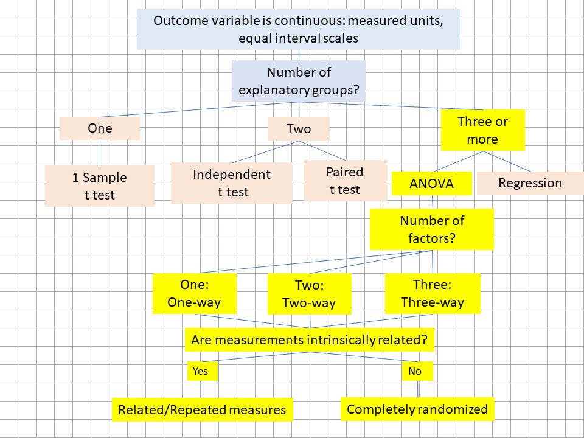
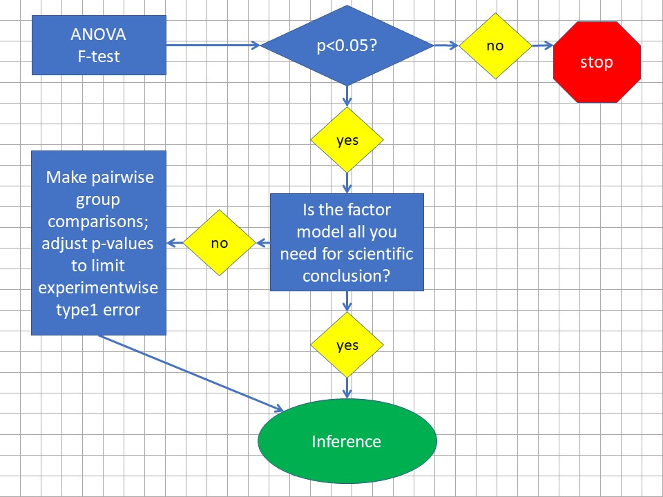

# Introduction to ANOVA
```{r message=FALSE, warning=FALSE}
library(tidyverse)
library(RColorBrewer)
```
The choice of any statistical design and analysis is always driven by the type of outcome and predictor variables involved. Recall that all variables are either continuous or discrete. Furthermore, it's helpful to think of outcome variables further classified as either [measured, ordered or sorted](\#data). 

Once the dependent variable is deemed to be continuous measured, the experimental design model is determined by the number of explanatory groups involved. If the grouping factor is discrete, use t-tests with two or fewer.

```{r echo=FALSE, fig.cap="ANOVA heuristic", message=FALSE, warning=FALSE}

```

The analysis of variance (ANOVA) is a method to design and evaluate experiments in which the predictor variable(s) are discrete factors for three or more groups and when the outcome variable is on some continuous measured scale. ANOVA is also univariate, in so far as the analysis involves only a single outcome variable.

The validity of an ANOVA depends upon fulfilling the following assumptions: 
* Every replicate is independent of all others.
* Some random process is used when generating measurements, 
* The distribution from which the outcome variable is derived is continuous random normal.
* The variances of the groups are approximately equal.

When the first two of these assumptions cannot be met, it's a scientific experience, not an experiment designed for unbiased hypotheses testing. There is no need pretend otherwise by performing statistical testing. In that case, just report descriptive statistics while omitting inference (ie, don't do p-values). 

On the basis of small samples it usually difficult to conclude that the 3rd and 4th assumptions are met. Both affirmative and negative results of tests of normality, tests for homogeneity of variance and outlier tests should be taken with a grain of salt. The smaller the sample size, the larger the grain of salt. Use your judgment. Do you have any reason to believe the variable is not normally distributed? Are you confident the variable being measured in a linear range? If a truly normally distributed variable is measured in the linear range, you can be reasonably confident that you are satisfying these assumptions.

Data that appears skewed can be transformed using log or reciprocal functions, followed by ANOVA testing on those transformed values.    

There are alternative analytic options as will be detailed below. In particular, there is no need to use ANOVA for discrete types of outcome data. ANOVA is not designed to analyze such data. Additionally, regression, either linear or nonlinear, is often a preferred method of analysis when the predictor variable is continuous rather than discrete.

ANOVA represents a family of about a dozen or so statistical tests. These differ by how many predictor factors are involved and whether or not the measurements are intrinsically-related such that replicates are completely randomized or repeated/related. 

ANOVA experiments tend to design themselves since they are fairly intuitive way of asking questions. In fact, ANOVA is probably the most widely used experimental design in the biomedical sciences. If you go to any article in your favorite journal randomly, chances are it will have a figure or table depicting an ANOVA design, which would look something like these.

```{r echo=FALSE, fig.cap="Typical graphs depicting some of the different ANOVA designs.", fig.height=3, fig.show="hold", fig.width=5, message=TRUE, warning=TRUE}

one.way <- data.frame(
            factorA=c(
              rep("level1", 5), 
              rep("level2", 5), 
              rep("level3", 5)
              ),
             
            response=c(rnorm(5,100,20),
                       rnorm(5,200,20), 
                       rnorm(5,300,20)
                       )
  )

two.way <- data.frame(
            factorA=c(
              rep(c(
                rep("level1", 5), 
                rep("level2", 5), 
                rep("level3", 5)
                ), 
                2)
              ),
            factorB=c(rep("level1", 15), rep("level2", 15)),
            response=c(rnorm(5,100,20),
                       rnorm(5,200,20), 
                       rnorm(5,300,20), 
                       rnorm(5, 400, 20), 
                       rnorm(5, 500, 20), 
                       rnorm(5, 600, 20)
                       )
  )

three.way <- data.frame(
            factorA=c(
              rep(c(
                rep("level1", 5), 
                rep("level2", 5), 
                rep("level3", 5)
                ), 
                4)
              ),
            factorB=rep(c(rep("level1", 15), rep("level2", 15)), 2),
            factorC=c(rep("factorC level1", 30), rep("factorC level2", 30)),
            response=rep(c(rnorm(5,100,20),
                       rnorm(5,200,20), 
                       rnorm(5,300,20), 
                       rnorm(5, 400, 20), 
                       rnorm(5, 500, 20), 
                       rnorm(5, 600, 20)
                       ), 2)
            
  )
  
ggplot(one.way, aes(factorA, response))+
  stat_summary(fun.y="mean", geom="bar", width=0.2, fill="#1b9e77")+
  labs(y="response, continuous units", title="One-way ANOVA")

ggplot(two.way, aes(factorA, response, fill=factorB)) +
  stat_summary(fun.y="mean", fun.args=list(mult=1), geom= "bar", position=position_dodge(width=1), width=0.5, size=2)+
  scale_fill_brewer(palette="Dark2")+
  labs(y="response, continuous units", title="Two-way ANOVA")

ggplot(three.way, aes(factorA, response, fill=factorB))+
  stat_summary(fun.y="mean", geom="bar", position=position_dodge())+
  facet_grid(cols =vars(factorC))+
  scale_fill_brewer(palette="Dark2")+
  labs(y="response, continuous units", title="Three-way ANOVA")
               
```

The reasons why ANOVA is so popular are very simple.

First, ANOVA is versatile. ANOVA allows for testing many groups simultaneously, for one or more factors, each at several levels. You can test for the main effect of each factor, or for interactions between factors. You can also test for differences between specific individual groups, using post hoc analysis. Repeated/related designs are readily accommodated, including mixed designs where one factor is completely randomized and another is related measure within a single multi-factor experiments.

Second, ANOVA is efficient. Fewer experimental units are needed to make the same number of pairwise group comparisons than would otherwise be necessary using a t-test-based experimental design. That efficiency can improve modestly as the number of groups increases.

As you know, each individual hypothesis test carries a risk of type1 error. In one sense, ANOVA serves as a protocol to detect differences between many groups while ensuring that the overall type1 error, the so-called experimentwise error, remains fixed at the same tolerable threshold we'd set for a single t-test between two groups.

## Factors and levels

In ANOVA jargon, predictor variables are classified as "factors". ANOVA designs are said to be factorial. They are multifactorial if more than a single factor is involved. In other corners, ANOVA is referred to as factorial analysis (which should not be confused with factor analysis). Where some people describe an ANOVA experiment as a "one-way ANOVA" others might describe it as "one-factor ANOVA". It's all the same.

The factors of ANOVA represent categorical, discrete variables that are each applied at two or more levels. For example, a factor at three levels is a predictor variable that has three discrete values and those three groups in the experiment.

Imagine an experiment to explore how a particular gene influences blood glucose levels. Blood glucose levels, a continuous response variable, are measured in experimental units comprising a total of three different genotypes: wild-type, heterozygous knockouts of that gene, and homozygous knockouts of the gene. Here, genotype is a discrete predictor variable, a factor, which has three levels. 

To run functions related to ANOVA, R requires that your predictor variables are classified as factors in data sets. 

The following script creates a vector object called `genotype`. The object is a representation of the genotype variable. The data class for that vector is `character` because it is comprised of character strings. But look what happens when it is packaged into a data frame called `my.factors`. R coerces `genotype` into a factor variable with 3 levels. Which is nice.

```{r}
genotype <- c("wild-type", "heterozygote", "homozygote")
class(genotype)
my.factors <- data.frame(genotype)
str(my.factors)

```

In contrast, this coercion won't occur if a factor in an experiment represents a variable with continuous scale values. To illustrate what I mean by this, imagine adding a factor to the genotype experiment. We would test for the effect of an antidiabetic drug on blood glucose at 0, 10 and 30 microgram/kg. These effects would be measured at each level of the genotype factor. 

We would create the vector `drug` as an object representing the drug variable and its three levels as follows. Note however that here, R does not coerce numeric values as factors:

```{r}
drug <- c(0, 10, 30)
my.factors <- data.frame(genotype, drug)
str(my.factors)
class(drug)

```

That's easily fixed using the `as.factor` function

```{r}
drug <- as.factor(c(0, 10, 30))
my.factors <- data.frame(genotype, drug)
str(my.factors)
class(drug)

```

Alternately, we would enter the drug levels as character strings, which would be coerced into a factor at two levels when added to a data frame, like for the first example above:

```{r}
drug <- c("zero", "ten", "thirty")
```


I bring this up to point out that you can do ANOVA with continuous predictor variables. You just have to treat them as factors. 

When a continuous predictor variable is used at many levels (eg, a time series, a dose series, etc), regression *per se* may can be a better alternative to ANOVA. Regression allows for capturing that additional information encoded within continuous variables. 

But that decision is more scientific than it is statistical. For example, you would use regression rather than ANOVA if the goal is to derive regression parameter estimates, such as slopes for rates or affinity constants. Only use ANOVA when the goal is to determine whether the factor has any effect at all, or if it interacts with some other factor.

Be aware that R will bark out error messages at you ff you use continuous variables as factors without actually converting them to factor class objects.

## ANOVA models: One-, Two-, and Three-way

If an experiment has only one factor, it a one-way ANOVA design (alternately, "one-factor ANOVA"). If an experiment has two factors, it is a two-way ANOVA or two factor design. Three factors? Three-way ANOVA. These models can also be either completely randomized, repeated/related measures, or mixed.

In a completely randomized structure, every level of the factor(s) is randomly assigned to replicates. Every replicate measurement is independent from all others.  

In a related measures structure, measurements within an experimental unit are intrinsically-linked. Every replicate receives *all* levels of a factor (eg, before-after, stepped dosing, or when subjects are highly homogeneous, such as cultured cells or inbred animals).

Thus, the possible ANOVA models are quite diverse:

* One-way ANOVA -completely randomized
* One-way ANOVA -related measures
* Two-way ANOVA -completely randomized on both factors
* Two-way ANOVA -related measures on both factors
* Two-way ANOVA -mixed, one factor completely randomized, the other factor related measures
* Three-way ANOVA -can be CR, RM or mixed, 

I should mention that ANOVA for even more than three factors is conceptually possible. However, you are strongly cautioned such large, complex designs have considerable downside.

Three-way ANOVA, for example, allows for such a large number of hypotheses to be tested (three different main effects and four possible interaction effects, not to mention the large number of post hoc group comparisons) that it can be difficult to conclude what is responsible for any observed effects. These larger designs also tend to break the efficiency rule, it's fair to say that three way ANOVA designs tend to be over-ambitious experiments...over-designed and usually under powered for the large number of hypotheses they can test.

Designing an experiment as completely randomized or related measures is largely a scientific, not a statistical, decision. What that means is this: measurements are either intrinsically-linked or they are not. Making that determination is a scientific call, based upon the nature of the biological material that you are working with. When you've concluded measurements are intrinsically-linked, then the choice must be a related measures design and analysis.

Similarly, choosing to run experiments as one-way or two-way ANOVA designs is also scientific. In fact, you would choose the latter mostly to test whether two factors interact. If you are uninterested in whether two factors interact, don't combine them in an experiment. You might wish to ask your questions using separate one-way ANOVAs, instead.

We'll discuss interaction hypotheses and effects in more detail later.

## ANOVA inference protocol

ANOVA can be used inferentially as stand alone test, or as an omnibus test. The test statistic for ANOVA is the F-test, which will be described below. 

A positive F-test result can be used to infer whether a factor, or an interaction between factors, is effective. 

Given the example above, I can use positive F-test to conclude that genotype at a given locus influences blood glucose. And just leave it at that, without demonstrating which conditions differ from each other.  

Alternately, a positive F-test result can be used as an omnibus. Here, a positive F-test implies that at least two group means differ from each other. The positive F-test grants access to explore which group means differ from each other. This is done by making pairwise group comparisons.

The decision to use the F-test as a stand alone or as an omnibus is driven by your scientific objectives.

```{r echo=FALSE, fig.cap="ANOVA work flow", message=FALSE, warning=FALSE}

```

These "post hoc" pairwise comparisons are, essentially, any of several variations on the t-test designed to adjust p-values on the basis of the multiple comparisons.

The choices of groups to compare after the F-test are driven by scientific, rather than statistical, reasoning. You can compare all groups to each other, or you can compare a much more limited subset of groups. 

What is important, statistically, is to make adjustments to the p-value threshold given all the comparisons made, so that the experimentwise type1 error does not exceed your declared threshold (usually 5%).

In an experiment whose number of groups equals $k$, there are a total of $\frac{k(k-1)}{2}$ possible comparisons to make.

Let's use the simplest case of a $k=3$ groups ANOVA as an example. There are $C=\frac{3(3-1)}{2}=3$ comparisons that can be made. Using the Bonferroni correction ($p_{adjust}=\frac{0.05}{C}=0.01667$), only comparisons between 2 groups whose p < 0.0167 would test as different from each other.    

## ANOVA calculations

The simplest way to think about ANOVA is that it operates like a variance budgeting tool. In the final analysis, the higher the ratio of the variance associated with the grouping factor(s) compared to the residual variance, the more likely that some group means will differ. 

ANOVA uses the least squares method to derive and account for sources of variation within a data set.

Recall that the variance of a random variable $Y$ is estimated through sampling, and calculated by dividing the sum of its squared deviates, $SS$, by the sample degrees of freedom (df). 

\[var(Y)=\frac{\sum_{i=1}^n(y_i-\bar y)^2}{n-1}=\frac{SS}{df}=MS\]

In ANOVA jargon the variance is also commonly referred to as the mean square $MS$, illustrating that variance can be thought of as an averaged deviate.

Now, that formula only illustrates how variance is calculated for a single sample group. What about multiple groups? As you might imagine, we have to incorporate information from all of the groups. 

To begin to understand that, recognize that all ANOVAs, irrespective of the specific design have two fundamental sources of variation:

1) Variation due to the experimental model, which is specified by the nature of the predictor variables.
2) Residual variation, which is variation that cannot be explained by predictor variables.

A useful property of sums of squared deviates is that the total variation within an experiment, whether due to known or known sources, can be accounted for.

That total variation within an experiment can be expressed as the sum of the squared deviates, and it is the sum of the squared deviates for the model and residual components: \[SS_{total}=SS_{model}+SS_{residual} \]

Perhaps it helps if you first think about this visually.

Let's imagine a simple one-way completely randomized ANOVA data set that looks like the graph below. There is only one factor, at three levels. Each group has five independent replicates, for a total of 15 replicates within the entire experiment. 

We would express the model for this experiment as
\[SS_{model}=SS_{genotype} \]

and thus \[SS_{total}=SS_{genotype}+SS_{residual} \]

The graph illustrates each data point, the means for each group (black bars) and the grand mean of the sample (gold bars). You can readily imagine the distances from the data points to the group means and to the grand means. You can also appreciate and the distances from the group means to the grand mean. You probably have a harder time visualizing the squares of those distances. My mind sees it Euclidean (geometrically). Larger distances, squared, lead to bigger boxes! The bigger the boxes, the greater that replicate contributes to the variance.

With that picture in mind, think of the variances within the experiment as follows:

* Total variance: average squared distances of the all the points to the grand mean
* Model variance: weighted average squared distances of group means to the grand mean
* Residual variance: average squared distances of the points to the group means

```{r echo=FALSE, message=FALSE, warning=FALSE, fig.cap="A completely randomized one way ANOVA, the genotype factor has three levels. Gold bar = grand mean, black bar = group means"}
set.seed(123456)
wild_type <- rnorm(5, 100, 20)
heterozygous <- rnorm(5, 150, 20)
homozygous <- rnorm(5, 200, 20)

data <- data.frame(wild_type, heterozygous, homozygous)
tab.data <- data.frame(wild_type, heterozygous, homozygous)
  
data <- gather(data, key="genotype", value="blood_glucose") %>%
  mutate(genotype = factor(genotype, levels = c("wild_type", "heterozygous", "homozygous")))
avg <- mean(data$blood_glucose)
vari <- var(data$blood_glucose)

ggplot(data, aes(genotype, blood_glucose))+
  geom_jitter(size=6, alpha = 0.5, width=0.2, color="#012169")+
  ylab("blood_glucose, ng/dl")+
  stat_summary(fun.y = mean, geom = "point", shape = 95, size=15) +
  geom_hline(yintercept = avg, color = "#f2a900", size=2) +
  scale_y_continuous(limits=c(20, 250))
```

### Sums of Squares partitioning

The first step in an ANOVA involves partitioning the variation in a data set using sums of squares.

In this experiment, there are $i=1, 2..n$ independent replicates. There are also $j=1, 2..k$ groups.

The total sum of squares is the sum of the squared deviation from all data points to $\hat y$, which is the grand mean of the sample. 

\[SS_{total}=\sum_{j=1}^k\sum_{i=1}^n(y_i-\hat y)^2\]

The sum of squares for the genotype effect is sum of the weighted squared deviation between the group means, $\bar y_j$ and the grand mean. Here, $n_j$ is the sample size within the $j^{th}$ group.  

\[SS_{genotype}=\sum_{j=1}^kn_j(\bar y_j-\hat y)\]

Some software refers to this variation as the "treatment" sum of squares.

Parenthetically, let's pause to reflect for a moment to consider one consequence of how that equation shows the weighting of group deviation by sample size. The level of model variation can skew to one group when its sample size differs markedly from the others. This explains why you want to keep group sizes reasonably balanced, or roughly equivalent, when designing experiments.

Finally, the residual sum of squares is calculated as the sum of the squared deviation between replicate values and group means, 

\[SS_{residual}=\sum_{j=1}^k\sum_{i=1}^n(y_i-\bar y_j)^2\]

which, because the total variation amount of is fixed, can also be calculated as follows:

\[SS_{residual}=SS_{total}-SS_{genotype}\]

In some software residual variation is referred to as "error". The term "error" arises from ANOVA theory, which states that the true population means represented by these sample groups are "fixed" in the population. Thus, any variation associated with our estimate must be in error.

Perhaps you can intuit a few things. First, the residual variation is the variation unaccounted for by the model. Meaning that whatever causes it is not under experimental control. 

Second, if the variation around each group remains similar, as the group means differ from each other more, the greater the fraction of the overall variation that will be associated with the model, and the less that will be associated with the residual. 

Third, when the noise around those group means increases, less of the total variation will be associated with group mean ,and the more with the residual. 

In other words, noisy experiments tend to hide detectable differences between means, while clean experiments favor detecting these differences. 

The following two graphs emphasize these observations. In the null graph, the group means are roughly equivalent and very nearly the same as the grand mean. There's very little model variation. Most of the variation is in the residuals.

In the effective treatment graph, where the means truly differ because I coded them to differ, the residual variation is about the same as the null. But you can see there is a lot more model variation, at least compared to the null graph.


```{r echo=FALSE, fig.height=2, fig.width=3, message=FALSE, warning=FALSE, fig.show="hold"}
set.seed(123456)
wild_type <- rnorm(5, 100, 20)
heterozygous <- rnorm(5, 100, 20)
homozygous <- rnorm(5, 100, 20)

data <- data.frame(wild_type, heterozygous, homozygous)
tab.data <- data.frame(wild_type, heterozygous, homozygous)
  
data <- gather(data, key="genotype", value="blood_glucose") %>%
  mutate(genotype = factor(genotype, levels = c("wild_type", "heterozygous", "homozygous")))
avg <- mean(data$blood_glucose)
vari <- var(data$blood_glucose)

ggplot(data, aes(genotype, blood_glucose))+
  geom_hline(yintercept = avg, color = "#f2a900", size=2) +
  geom_jitter(size=6, alpha = 0.5, width=0.2, color="#012169")+
  labs(y="blood_glucose, ng/dl", title="Null")+
  stat_summary(fun.y = mean, geom = "point", shape = 95, size=15) +
  scale_y_continuous(limits=c(20, 250))


set.seed(123456)
wild_type <- rnorm(5, 100, 20)
heterozygous <- rnorm(5, 150, 20)
homozygous <- rnorm(5, 200, 20)

data <- data.frame(wild_type, heterozygous, homozygous)
tab.data <- data.frame(wild_type, heterozygous, homozygous)
  
data <- gather(data, key="genotype", value="blood_glucose") %>%
  mutate(genotype = factor(genotype, levels = c("wild_type", "heterozygous", "homozygous")))
avg <- mean(data$blood_glucose)
vari <- var(data$blood_glucose)

ggplot(data, aes(genotype, blood_glucose))+
  geom_hline(yintercept = avg, color = "#f2a900", size=2) +
  geom_jitter(size=6, alpha = 0.5, width=0.2, color="#012169")+
  labs(y="blood_glucose, ng/dl", title="Effective")+
  stat_summary(fun.y = mean, geom = "point", shape = 95, size=15) +
    scale_y_continuous(limits=c(20, 250))
 
```

### Degrees of freedom

Again, variance is an averaged deviation. To calculate a variance we'll need to divide the sum of squares for a component by its degrees of freedom. Just as sum of squares are calculated differently depending on whether it is total, or model or residual, so too are degrees of freedom.

The theory behind $df$ is a bit more complicated than this, as a general rule, we lose a degree of freedom every time the calculation of a mean is involved in determination of a given $SS$.   The basic idea is this: For that mean value to be true, one of the replicates must remain fixed, while all the others are free to vary. 

The degrees of freedom for total variance are $df_{total}=N-1$. We use all 15 replicates, $N$, to calculate $\hat y$, the grand mean. We lose a degree of freedom because for that grand mean to be true, one of those replicate values must be fixed while the others are free to vary. 

We have $k$ groups. The degrees of freedom for the genotype model variance are $df_{genotype}=k-1$, because the calculation is based upon the group means, two of which can be free to vary.

The residual degrees of freedom are $df_{residual}=N-k$.

### The mean squares

The mean squares are ANOVA jargon to represent variances, and variance can be thought of as averaged variation.

Total variance is \[MS_{total}=\frac{SS_{total}}{df_{total}} \]

The variance associated with the model is \[MS_{model}=\frac{SS_{model}}{df_{model}} \]

And the residual variance is \[MS_{residual}=\frac{SS_{residual}}{df_{residual}} \]

### The ANOVA table

The typical ANOVA table lists the following:

*source of variation, 
* its $df$, 
* its $SS$, 
* its $MS$ 
* an F-test, where appropriate 
* a p-value from the F-test

ANOVA functions in R vary in their output. But here's the ANOVA table output for the data in the last previous figure:

```{r}
anova(lm(blood_glucose ~ genotype, data))
```

### The F-test

F-tests are the first step in drawing inference in ANOVA. The value of F is the ratio of two variances. For the result in the ANOVA table above $F=\frac{10588.4}{460.8}=22.979$. The variance associated with the genotype model is 22.979x greater than the residual variance.

The p-value is derived from an F probability distribution with 2 and 12 degrees of freedom. The result in the table can be mimicked using R's [`pf` function](@\fdistr)):

```{r}
pf(22.979, 2, 12, lower.tail=F)
```

The example above is a simple one factor completely randomized model for which there is only one F test, because it has only one component. A two-way ANOVA would have three F tests if completely randomized, but would have a total of five if related measures for both factors were involved.   


## Completely randomized or related measures

Up until now we've discussed ANOVA in its simplest use case, the one-way completely randomized (CR) ANOVA. 

Related measures (RM) ANOVA is done when the measurements are not completely independent, but instead are intrinsically-linked. 

Examples of intrinsically-linked subjects include 

* identical human twins, 
* before and after on a single subject,
* all plates and wells from a single batch or passage of a cell culture, 
* a protein preparation from a single batch,
* a single cell in culture,
* split tissues from one animal subject, and 
* litter mates of isogenic animal strains. 

There are certainly others.

Since an RM design involves taking multiple measurements from each of the same subjects we can assess the variation associated those subjects. That source of variation is no longer in the residual error term, it goes right into the model.

### The problem of lost data in related measures designs

The CR vs RM design decision has a few important consequences. 

First, when within-subject correlation is high, RM are much more efficient and less costly to produce. How much more? You can run Monte Carlo simulations to establish this for virtually any set of conditions.

Second, over the course of any experiment it is possible to lose specific response values here and there. For example, a data value may be lost due to a bad lane in a replicate western blot, you accidently throw away a tube from a series, or any of a number of such primitive errors.

CR ANOVA is tolerant of such losses. That leads to a missing replicate, and an unbalanced data sets, but it's only one or a few values out of many.

That is not the case with related measures designs, whose data sets cannot be unbalanced. All of the values for every level of every factor for every replicate must be included. If any values are missing for a given replicate, all of the remaining values for that replicate have to be censored. 

The missing data problem becomes amplified in two way and three way related measures ANOVA! Those experiments tend to have more groups, meaning more data is at risk of being censored.

Researchers often ask if it is reasonable to 'flip' to a completely randomized analysis when this happens? 

No.

There are a couple of options to deal with this, and both happen in planning. First, where possible, include an extra replicate or two as a hedge over what the power analysis suggests is necessary. Second, don't make a RM design too over-ambitious. Limit the number of levels to that which is scientifically important. Third, be aware of the risk. Is the experimental protocol difficult, with intrinsic barriers to efficiently collecting data?

## Two-way ANOVA

This is a method to investigate the effects of two factors simultaneously. Thus, the variation associated with each factor can be partitioned. This also allows for assessing the variation associated with an interaction between the two factors.

What is an interaction? Simply, it is a response that is greater (or lesser) than the sum of the two factors combined.

Let's go back to the genotype blood_glucose problem, add a factor, and simplify the study a bit. We're interested in a gene that, when absent, raises blood glucose. We're also interested in a drug that, when present, lowers blood glucose. We'll design a $2\times 2$ experiment that has only the presence or absence of each of these factors.

We hypothesize the gene and the drug may interact. In other words, the prediction is that the drugs blood glucose lowering effect is greater in the absence of the gene.

Here's the result:

```{r}
set.seed(12345)
blood_glucose <- round(c(rnorm(5, 100, 20), rnorm(5, 75, 20), rnorm(5, 200, 20), rnorm(5, 100, 20)), 1)
drug <- as.factor(rep(rep(c(0, 30),each=5),2))
genotype <- rep(c("WT", "KO"), each=10)

test <- data.frame(genotype, drug, blood_glucose)

y0 <- mean(subset(test, genotype=="WT" & drug==0)$blood_glucose)
y30 <- mean(subset(test, genotype=="WT" & drug==30)$blood_glucose)
yend0 <- mean(subset(test, genotype=="KO" & drug==0)$blood_glucose)
yend30 <- mean(subset(test, genotype=="KO" & drug==30)$blood_glucose)
  
ggplot(test, aes(genotype, blood_glucose, color=drug))+
  geom_jitter(size=6, width =0.3)+
  scale_color_brewer(palette="Dark2")+
  stat_summary(fun.y=mean, geom="point", shape = 95, size= 15)+
  scale_x_discrete(limits=c("WT", "KO"))+
  labs(y="blood glucose")+
  geom_segment(aes(x="WT", y=y30, xend="KO", yend=yend30))+
  geom_segment(aes(x="WT", y=y0, xend="KO", yend=yend0))
```

An interaction effect is represented by the differing slopes of those two lines. The effect of the drug is not the same at both levels of genotype. Or you could say the effect of the genotype is not the same at both levels of the drug. Whatever.

A statistical interaction occurs when the effects of two factors are not the same across all of their levels.

What this means biologically requires scientific judgement and knowledge about the two factors you're working with. I know a bit about pharmacology. If that gene is for a protein that metabolizes drugs, it's loss could lead to a larger blood glucose-lowering effect of the drug.

Here's the ANOVA table for those data.

```{r}
anova(lm(blood_glucose ~ genotype + drug +genotype*drug, test))
```
 
 It might be useful to see the data for what follows.
 
```{r echo=FALSE}
knitr::kable(test)

```


Four sources of variation are accounted for: the main effect of genotype, the main effect of drug, the interaction between drug and genotype, and the residual error.

Three F tests were performed. Each of these used $MS_{residual}$ in the denominator and the $MS$ for the respective source in the numerator.

How has this variation been determined?

The experimental model is as follows: \[SS_{model}=SS_{genotype}+SS_{drug}+SS_{genotype\times drug} \]

The grand mean of all the data is computed as before: \[\hat y=\frac{1}{n}\sum_{i=1}^ny_i \]

There are two factors, each at two levels. Thus, there are a total of $j=4$ experimental groups. Each group has a sample size of $n_j=5$ replicates and represent a combination of predictor variables: WT/0, WT/30, KO/0, KO/30. The mean of each group is $\bar_j$. 

Therefore, \[SS_{model}= \sum_{j=1}^kn_j(\bar y_j-\hat y)^2 \] represents the total model variation.

We can also artificially group these factors and levels further. Two groups correspond to the levels of the genotype factors and two correspond to the levels of the drug factor. Their means are  $\bar y_{wt}, \bar y_{ko}$ and $\bar y_0, \bar y_{30}$, respectively. Each of these groups has a sample size of $2n_j$. 

These contrived means are used to isolate for the variation of each of the two factors: 

\[SS_{genotype}= \sum n_{wt}(\bar y_{wt}-\hat y)^2+n_{ko}(\bar y_{ko}-\hat y)^2 \]

\[SS_{drug}= \sum n_{0}(\bar y_{0}-\hat y)^2+n_{30}(\bar y_{30}-\hat y)^2 \]

All that remains is to account for the variation associated with the interaction effect. That can be solved for algebraically: \[SS_{genotype\times drug}=SS_{model}-SS_{genotype}-SS_{drug} \]

And so we compare the three genotype levels. We think an antidiabetic drug would have an effect, and we compare three levels of it. We wouldn't combine the drug and the genotype together if we didn't think


Because two way ANOVA's have two factors, one of the factors can be applied completely randomized, and the other can be applied as related measures. Or both factors can be completely randomized, or both can be related measures.

## Other ANOVA models

For all ANOVA experiments, irrespective of the design, the total amount of deviation in the data can be partitioned into model and residual terms:

\[SS_{total}=SS_{model}+ SS_{residual}\]

What's interesting is that different ANOVA experimental designs have different models. We're interested in two factors, factorA and factorB, and have the ability to study each at multiple levels. The interaction between factorA and factorB is $A\times B$

One way CR: $SS_{model}=SS_{factorA}$ 

One way RM: $SS_model=SS_{factorA}+SS_{subj}$

Two way CR: $SS_{model}=SS_{factorA}+SS_{factorB}+SS_{A\times B}$

Two way RM on A factor: $SS_{model}=SS_A+SS_B+SS_{A\times B}+SS_{subj\times A}$

Two way RM on both factors: $SS_{model}=SS_A+SS_B+SS_{A\times B}+SS_{subj\times A}+SS_{subjXB}+SS_{subj\times A\times B}$

The big difference between completely randomized and related measure designs is that in the latter, we're now accounting for the deviation associated with each replicate in the model! Otherwise, that replicate deviation would have been blended into the residuals.

This turns out to be a pretty big deal. When that deviation due to the subjects is pulled out of the residual, it lowers the value of the denominator of the F statistic. Thus making the F statistic larger!

### R and ANOVA

There are a handful of ways to conduct ANOVA analysis on R. These are not necessarily more right or wrong than the others. What is important to know, however, is that they do perform calculations differently under certain circumstances (eg, Type 1 v Type 2 v Type 3 SS calculations). Therefore, they produce distinct results which can be confusing, particularly when comparing R's results to other software you might be familiar with. 

This again emphasizes the need to share specific details of the analysis in our publications. In this case, specify using R, specify the R function used, and even specify the `type` argument used in ezANOVA.

Given data and a group of arguments we'll call foo, R's ANOVA function options are as follows:

`anova` - A function in R's base.  eg, `anova(lm(foo))`

`aov` - A function in R's base. eg, `aov(foo)

`Anova` - A function in R's car package. eg, `Anova(lm(foo))`

`ezAnova` - A function in R's ezAnova package, `ezAnova(foo)`

There are others. For example, since ANOVA analyses are also general linear models the same basic problem can also be solved using `lm(foo)`without ANOVA. Passing an `lm(foo) into an ANOVA function is generally designed to provide you an ANOVA table.

For the ANOVA part of this course, we'll use `ezANOVA` from the `ez` package. In particular, it is a bit more straightforward to use than the other options when dealing with related measures and with two-way ANOVA, which are very common in biomedical research.

**Key Jargon to understand to do ezANOVA in R** 

Don't confuse ezANOVA's use of between and within the way it is used elsewhere in ANOVA jargon.

Specify a completely random design by defining the **'between'** variable as your factor name. The between here is meant to imply comparisons between groups. 

Specify a  related measures design by defining the **`within`** variable as your factor name. The within here is meant to imply comparisons within replicates. 

Sum of squares `type` refers to the method of calculating the sum of squares: type 1, type 2 or type 3. [Type1, 2 and 3 sum of squares are explained here](https://www.r-bloggers.com/anova-%E2%80%93-type-iiiiii-ss-explained/)

Suffice to say this is important to not overlook and again serves to illustrate providing good detail about the software used to analyze data. The most significant point to understand is that some commercial software uses type 3 calculations by default. As a consequence, given the same data set, the results from those packages may not coincide perfectly with those of ezANOVA. The latter gives you the option to specify the `type` for analysis. 

My recommendation is to stick with the default, `type 2`. 

## Alternatives to ANOVA

When the outcome variable is measured and the design is completely randomized, the data can be analyzed using the general linear model with R's `lm` function, rather than by ANOVA. This allows for analyzing interaction effects between factors. The results will be the same as ANOVA. If the design has a related measures component, then a linear mixed effects model should be run instead. In that case, use `lmer` in the `lme4` package.

Alternately a nonparametric analysis can be performed using either the Kruskal-Wallis (completely randomized) for the Friedman (related measures) test. Bear in mind that there is no nonparametric analog for the two-way ANOVA. Thus, hypotheses related to interaction effects are not testable using nonparametric statistics.

Finally there is the generalized linear model (`glm`) for completely randomized designs or the generalized linear mixed model (`glmer`) for designs that incorporate related measures, respectively. Each of these allow for testing interactions between factors. These allow for a flexible array of outcome variables. These should be used, rather than ANOVA, when the outcome variable is non-normal or is discrete. For example, these are the tools of choice when the outcome variable is binomial or frequency data and there are 3 or more groups to compare. Additional families are possible.

### Screw ANOVA, Just Tell Me How to t-Test Everything

OK, fine. 

This is far from ideal because of the bias it introduces. You don't *have* to do ANOVA for an experiment with 3 or more groups (or anything else for that matter--you just have to be able to defend your choices). A major purpose of ANOVA is to maintain an experiment-wise type1 error of 5%. But there are other ways to accomplish this objective.

For example, you might skip the ANOVA step and simply run serial t-tests comparing all of the groups in an experiment. Or run t-tests to compare a **pre-planned** sublist of all possible comparisons. The emphasis here on pre-planning is important. Make decisions ahead of time about what is to be compared, then make only those comparisons. No more and no less. Otherwise, you're snooping. Once you're in snooping mode, you're deeply biased towards opportunistic outcomes.

For example, you may run multiple control groups within your experiment to signal that some important aspect of the protocol is working properly, but these controls are otherwise not scientifically interesting (with respect to testing new hypotheses). You may not wish to expend any of your type1 error budget doing comparisons on these controls.

With those reservations noted, what follows are two ways to go about this.

To begin, if we have $k$ predictor variables and $k$ groups in our experiment it has a **total** of $C=k(k-1)/2$ possible comparisons that could be made.

The `pairwise.t.test` is the function to use for this purpose. Use it to make the group comparisons that interest you. choosing the `p.adjust.method` that strikes your fancy. Two of the latter are listed below.

##### Bonferroni Correction

If $C$ is the number of comparisons to be tested, whether or not it is equal to $k(k-1)/2$, and if $\alpha$ is the type1 error threshold you've set for the entire experiment, then the corrected type1 error threshold for each comparison is $\alpha_c=\frac{alpha}{C}$. 

Thus, you would reject the null hypothesis for any comparison for which a t-test yields a p-value that is less than $\alpha_c$.

##### Holm-Sidak Correction

This is a modestly more liberal alternative to the Bonferroni correction. Here, for $C$ comparisons and an experimentwise type1 error threshold $\alpha$, the corrected per comparison threshold would be $\alpha_c=1-(1-\alpha)^C$. 

Again, for a given comparison reject, the null if its p-value is less than $\alpha_c$.

