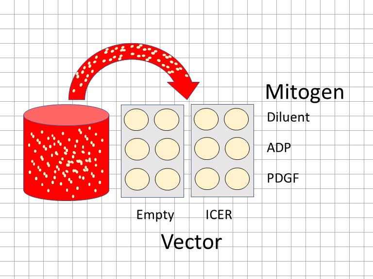

# Two-way ANOVA Related Measures {#twowayRM}

```{r echo=TRUE, message=FALSE, warning=FALSE, paged.print=FALSE}

library(tidyverse)
library(ez)
library(knitr)
library(kableExtra)
library(viridis)
```

A two-way ANOVA experimental design is one that involves two predictor variables, where each predictor has 2 or more levels. There is only one outcome variable in a 2 way ANOVA and it should be continuous, measured on an equal interval scale, and ideally sampled from a normally-distributed population. 

The predictor variables are often referred to as factors, and so ANOVA designs are synonymous with factorial designs. 

The list of two-way ANOVA experimental designs can be as follows:

1) Completely randomized (CR) on both factors
2) Related measures (RM) on both factors
3) Mixed, CR on one factor and RM on the other

In one sense, a two-way ANOVA can be thought of as two one-way ANOVA's run simultaneously. So it is possible to assess the effects of two factors at once. The major difference, however, is the ability to also test whether an interaction exists between the two factors.

In this chapter we'll focus on the data structure and analysis of a two-way ANOVA RM experimental design. These are particularly common in cell-culture and other in vitro-based experiments, owing to the homogeneity of the biological material.

For an experiment such as the one described below, all of the biological material assayed within a single replicate comes from a common source. Every well in every plate or every tube in every rack prepared from that source is identical, for all intents and purposes. Therefore, any measurements taken from these wells are intrinsically-linked. For this reason, the data should be analyzed as related-measures.

```{r echo=FALSE, fig.cap="A two-way ANOVA RM design viewed from the bench. Each combination of the two factors is tested in technical duplicate. All measurements are intrinsically-related.", message=FALSE, warning=FALSE, paged.print=FALSE}


```

An independent replicate occurs when the same protocol is followed, from start to finish, beginning with a new batch of plates or with a new batch of a purified protein or whatever. 

Even so, it's hard to argue these represent true biological replicates. The cells are likely clonal, and probably aren't changing much from batch to batch. The statistical analysis is therefore essentially focused on establishing whether the observations occur repeatedly or not. The replicates are therefore "blocked", usually in time. For example, an assay on the material on week1 is treated differently than one on week2 because these are two different time blocks.

## Cell culture

Coronary artery atheromas are enriched in fast-growing mesenchymal-like cells, which have prominent inflammatory characteristics. They express the transcription factor NFAT, which is regulated by mitogenic receptor signaling to control inflammatory gene expression. 

Cells from atheroma explants are easy to grow in culture, often indefinitely as for cancer cells. Eventually, a fast growing cell population dominates these monocultures when passaged serially. But these probably mimic the "bad" cells in an atheroma pretty well, so are useful to study.  

An experiment was performed on cultured human coronary smooth muscle cells derived from an atheroma to determine if the bzip suppresser ICER attenuates NFAT and whether it is mitogen-selective. 

One predictor variable is mitogen at 3 levels: vehicle, ADP and PDGF. A second predictor variable is an expression vector, which is either empty or encodes a cDNA to express ICER.

The output response, luminescence in cell extracts due to an NFAT-driven luciferase transcriptional reporter, is detected using a luminometer. Luminescence is linearly proportional to the amount of luciferase in the cells.

The protocol involved parallel transfections of the CASM cell line with the expression vectors and luciferase reporter, followed a few days later by treatment with the mitogens for 4 hrs before measuring luminescence. All treatments are performed in technical duplicate, from which the average value is used for the response measure.

Three predictions, and the corresponding null hypotheses that each tests, can be evaluated here simultaneously:

1) Icer and its control differ in how they each affect NFAT-mediated transcription. $H0:\sigma^2_{suppressor}\le\sigma^2_{residual}$
2) The mitogens differ in how they affect NFAT-mediated transcription. $H0:\sigma^2_{mitogen}\le\sigma^2_{residual}$
3) NFAT-mediated transcription is influence by a combination of suppressor and mitogen. $H0:\sigma^2_{suppressorXmitogen}\le\sigma^2_{residual}$

Here's some data:

```{r echo=FALSE, message=FALSE, warning=FALSE, paged.print=TRUE}
set.seed(54321)
x1 <- abs(round(rnorm(3, 25, 10), 1)) ##veh-empty
x2 <- abs(round(rnorm(3, 100, 10), 1)) #ADP-empty
x3 <- abs(round(rnorm(3, 150, 15), 1)) #PDGF-empty
x4 <- abs(round(rnorm(3, 15, 10), 1)) #veh-icer
x5 <- abs(round(rnorm(3, 75, 10), 1)) #ADP-icer
x6 <- abs(round(rnorm(3, 50, 15), 1)) #PDgf-icer


ID <- rep(LETTERS[1:3], each=6)

hcsmc <- data.frame(replicate=rep(LETTERS[1:3], 3), vector=rep(c("empty", "ICER"), each = 9), mitogen=rep(c(rep("Veh", 3), rep("ADP", 3), rep("PDGF", 3)),2), Nfatluc=c(x1, x2, x3, x4, x5, x6))

hcsmc %>% 
  kable() %>% 
  kable_styling()

```

```{r fig.cap="A cell culture-based two-way ANOVA RM experiment"}
ggplot(hcsmc, 
       aes(
         mitogen, 
         Nfatluc, 
         group=replicate)
       ) +
  geom_line(
    
  ) +
  geom_point(
    aes(
      color=replicate), 
    size=4
    ) +
  facet_grid(
    ~vector, 
    switch="both"
    ) +
  scale_shape_manual(
    values=c(16, 16)
    ) +
  scale_color_viridis(
    discrete=T
    ) +
  theme(
    legend.position="top"
    ) +
  scale_x_discrete(
    limits=c("Veh","ADP","PDGF")
    ) +
  labs(
    y="NFAT-luciferase, light units/mg", 
    x="Mitogen"
    )
```

## The test

Scientific judgement dictates running this test as related measures. Each replicate was performed on a different passage of cells, approximately 1 week apart. Within each passage the cells are highly homogeneous. The transfections and treatment and biochemical measurements were all conducted in a "side-by-side" block. The measurements within a replicate are intrinsically-linked. Perhaps most importantly, each measure taken on a given day is NOT independent of all other measures that day. But we can assume they differ from week to week. There really is no other way to analyze these data.


```{r paged.print=FALSE}
out.rm <- ezANOVA(data = hcsmc
                   , dv = Nfatluc
                   , wid = replicate
                   , within = c(vector, mitogen)
                   , type = 3
                   , return_aov = T
                   , detailed = T
  
); out.rm
```

## Interpretation of the output

Note here that we are NOT capturing an aov object. The only use of the aov object we might have is for posthoc testing with range tests. But we should not use range tests on a pure related measures design, where the means of groups are irrelevant.

### ANOVA Table

Note just as for the 2-way ANOVA CR analysis, there are 3 F tests for the model (the intercept F test is inconsequential for now). The F value for the suppress:mitogen interaction is beyond the critical limit for a null F distribution with 2 and 4 degrees of freedom. The result is extreme (p = 0.00613). The interaction takes precedence, since the main effects are difficult to interpret if an interaction occurs.

It is safe to reject the interaction null and conclude that variance for its effect exceeds that for its residual. Scientifically, this means that levels of NFAT-mediated transcription are influenced by both the suppressor and the mitogen stimuli, as designed in this experiment. About 68% of the variance in the data can be explained by this interaction effect.

### Mauchly's Sphericity Test

Sphericity is defined as uniform variance of the differences. Think of it as the RM analog to the CR homogeneity of variance assumption. Sphericity, as for homogeneity of variance, is an assumption ideally met in RM ANOVA for validity of the result.

Mauchly's tests the null hypothesis that the variances among the differences are equal. If the test statistic were extreme, the null would be rejected, meaning these variances are unequal and sphericity is violated. If that were the case, we'd conduct inference on the basis of a corrected p-value for the ANOVA..the p[GG], which is the Geisser-Greenhouse corrected p-value.

In our analysis, the Mauchly test is not extreme. We have no reason to believe the sphericity assumption is not satisfied. We can use the p-value in the ANOVA table to guide our inference, without using the sphericity correction.

## Post Hoc multiple comparisons

The true scientific objective here is to know whether the suppressor selectively attenuate NFAT-mediated transcription by either of the mitogens. In other words, scientifically, it would be interesting to learn whether an ICER-suppressible factor participates in the pathway of one of the mitogens, but not the other. 

Given that objective, there are some fairly specific planned comparisons worth making. If we compare ICER to Empty for each level of mitogen, we'll have an answer to the question posed above. In other words, we only care about 3 of the 15 possible comparisons that could be made.

Therefore, we'll run a `pairwise.t.test` without creating any adjusted p-values. After that, we'll create a small vector of p-values for the 3 comparisons we wish to make and use the `p.adjust` function to correct them for multiple comparisons.

Step1: Run the pairwise.t.test but don't adjust p-values

We use a `paired=T` argument given the intrinsically-linked relationship of the measures in the samples. Not all of the measures are independent so the unpaired t-test is inappropriate. 

```{r}
m <- pairwise.t.test(hcsmc$Nfatluc, interaction(hcsmc$vector, hcsmc$mitogen), paired=T, p.adj = "none")
m
```

Step2: Collect the p-values only for the comparisons of scientific interest

```{r}
pv <- c(m$p.value[1,1], m$p.value[3,3], m$p.value[5,5]) 
pv
```

Thus, the three comparisons and their unadjusted p-values are:

* ICER.ADP to empty.ADP p=0.3413
* ICER.PDGF to empty.PDGF p=0.0191
* ICER.Veh to empty.Veh p=0.7723

Step3: Adjust those p-values for multiple comparisons

```{r}
p.adjust(p=pv, method="bonf", n=length(pv))
```

Each of these adjusted p-values is greater than the type1 error threshold of 5%. On this basis, we cannot reject the null hypothesis that these response are the same.

This illustrates the occasional case where a positive result at the level of the omnibus test is coupled to a negative finding in post hoc testing. In fact, that shouldn't be a surprise. The F test sniffed out some decent sized effects within the collection of responses that are not of scientific interest.

## Write Up

*Statistical analysis of the luciferase data indicates there is an interaction between levels of the suppressor and the mitogen variables (2 way RM ANOVA, p=0.0061, n=3). However, post hoc comparisons do not support the hypothesis that ICER selectively suppresses either of the mitogens (pairwise two-sided paired t-tests, Holm adjusted p-values for multiple comparisons). The experiment may have been underpowered.*

## Summary
*We use two-way repeated measures ANOVA (both arms RM) when all measurements within each replicate are intrinsically-linked.
*When the experiment involves in vitro biological material there is a very good chance this ANOVA is the right choice.
*Inference can be done on only the main effect(s). When the interaction is positive, the main effects are difficult to interpret.
*Follow-up with pairwise.t.tests (paired=T), not with range tests.

