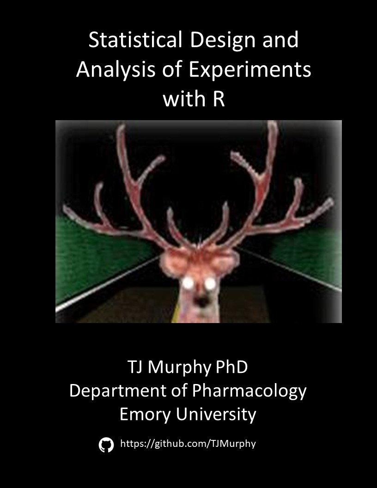

--- 
title: 'JABSTB: Statistical Design and Analysis of Experiments with R'
author: TJ Murphy PhD, Department of Pharmacology, School of Medicine, Emory University,
  Atlanta, GA  biostats538@gmail.com
date: "`r Sys.Date()`"
bibliography:
- book.bib
- packages.bib
description: Experimental biostatistics using R.
documentclass: book
link-citations: yes
location: Atlanta
site: bookdown::bookdown_site
biblio-style: apalike
---
# Preface {-}

```{r echo=FALSE, fig.height=3.66667, fig.width=2.83333, message=FALSE, warning=FALSE, paged.print=FALSE}

```

This book is a resource for students enrolled in my biostats course. 

The students are primarily in one of Emory's biomedical and biological sciences PhD programs. There class usually includes the ocassional Emory honors program undergrads, students from Emory's public health school, and a few Georgia Tech graduate students.

I'd been wrestling with the decision to switch my course over to R for a few years, but never really found a book that covers the subject the way I like to emphasize.  When I finally made the switch I needed to prepare a bunch of handouts. I did that using RMarkdown. Then I decided to write some intro handouts. Then I found [Bookdown](https://bookdown.org/yihui/bookdown/). Before I knew it, I had a "book". This is that. JABSTB. 

Not included in this book are additional materials for the course (eg, take home and group exercises, slide decks, data sets, my extensive collection of stats cartoons, etc). 

The scope of the book is to provide some background on statistical fundamentals that are most relevant to the biomedical researcher and to provide examples for running and interpreting various statistical functions. These people test ideas by generating data after manipulating some independent variable(s). They need to know principles of sampling, error, statistical hypotheses, types of data and experimental design. 

Each chapter has a corresponding RMarkdown document. If you wish to grab those documents (and any datasets read in those Rmarkdowns) instead of using this material as HTML, go grab it on Github. Simply fork, clone or download them from the [Github jabstb repo](https://github.com/TJMurphy/jabstb). 

This book is a living document, subject to a lot of on-the-fly revision. Stuff will be added and eliminated over time.

As I write these words, in Dec 2018, my main disclaimer is that it is definitely an MVP. 

If you find errors, have any suggestions, or would otherwise like to contribute, please submit a pull request and/or contact me by email. I welcome your additions.


Copyright 2018-2019 © TJ Murphy  MIT license.

